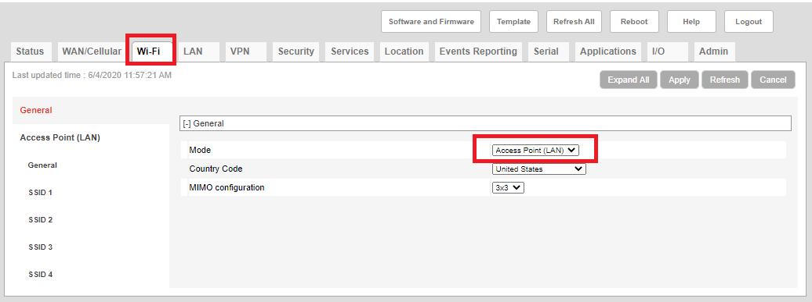
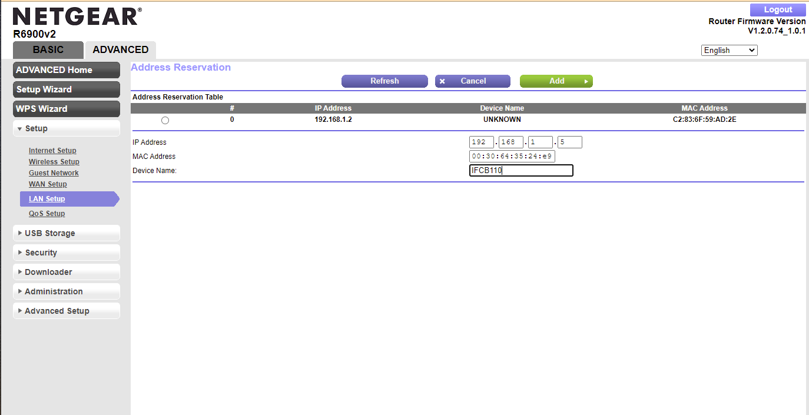
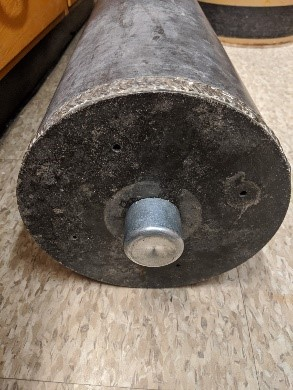

# 4. IFCB – setting up for installation

## 4.1. Pre-canning check

-  IFCB housing should be vacuumed with no visible dust or debris inside it or on the sealing edges. 

- The sealing edges must be checked for silicone lubricant. If there are particles (salt, sand, debris) the edge can be cleaned with isopropyl alcohol and dried off carefully before applying a good amount of silicone lubricant (Parker super O-lube) on the sealing edges. Apply with gloves on.

- Fresh desiccant bags, or desiccant bags stored in a 60℃ oven are used to minimize humidity in the IFCB housing. Desiccant bags can be placed secured together at the bottom of the IFCB frame under the sheath fluid containers. Care must be taken that these dessicant bags are not placed loosely in the pressure housing as the housekeeping boards and CPU are sensitive to mechanical shocks and located just above the sheath fluid containers.

- Metal stabilizing clip should be detached from below the end cap before canning is attempted.

- Check biocide and detergent bags contents (2/3 full, with about 400 ml of reagents), no bubbles, hanging off the knob above pumps (see appendix B for reagent recipes).  The side of the bags in contact with IFCB wiring should be covered in electrical tape or duct tape to prevent tearing of bags and leaking of contents.

- Blue Velcro strap should be now attached to hold in the biocide and detergent bags.

- Check contents of beads syringe, refill if running lower than 100 ml for a long-term deployment (see Appendix B for bead solution recipe).

- If using the **Windows OS**:

  On the IFCB check if remote desktop is enabled in Windows under **Settings** > **System** > **Remote desktop** > **Enable remote desktop**

  Check if IFCBacquire has been set up to start 60 seconds after start up in **Task Scheduler**.

  Run BCDedit command to stop Windows from starting in safe mode: Right click **Command Prompt** > **run as administrator**. Run following commands one at a time. Make sure you get the operation successful message.  

  ```
  bcdedit /set {default} bootstatuspolicy ignoreallfailures
  bcdedit /set {default} recoveryenabled No
  ```

​       All USB drives, connections should be disconnected from the IFCB 

​       Set # of syringes to 0 in IFCBacquire before disconnecting from monitor.

- If using **Linux OS** on the IFCB:

  Check VNC server settings to see if port 5800-5900 have been assigned to the IFCB.

  Run the following commands in Terminal/UXTerm to make sure the system does not enter any hibernation/sleep states

  ```
  sudo systemctl mask sleep.target suspend.target hibernate.target hybrid-sleep.target
  ```

  Shutdown the IFCB and disconnect from monitor. Connect using a remote connection through VNC and make sure the IFCB is not experiencing "small window VNC connection" issues. This issue sometimes shows up after several reboots of the system and can be fixed by attaching a small dongle on the VGA connector of the IFCB, and is available from McLane labs on request.

  Note: For Versalogic CPUs introduced in 2024 by McLane and for NVIDIA CPUs used by Brosnahan lab from 2023 there is an HDMI connection to use for monitor connection so there is no "small window" problem any more. For NVIDIA CPUs the USB connection on the board needs to be taped in place so the reagent bags do not disconnect power to the board.


## 4.2. Cellular modem set up

### 4.2.1. New MP70 set up

- To set up a new MP70, insert SIM card in slot on MP70, **note the static IP address** provided for the SIM card. If a static IP has not been set for the SIM card by the provider, communication with the IFCB using the following instructions will not be possible. 

  Note: The following instructions will only work if the DHCP settings on the IFCB are set to automatic as provided by McLane. If a manual IP address has been set for the IFCB this will need to be reversed back to the default setting. Helpful instructions on doing this here: https://support.microsoft.com/en-us/windows/change-tcp-ip-settings-bd0a07af-15f5-cd6a-363f-ca2b6f391ace

- Connect MP70 unit to the sharkfin antenna using all 6 cables and power on the unit, connect to a computer using a cat 5 ethernet cable. 

- Open a browser window and go to http://192.168.13.31:9191. This will open up the ACEmanager window. Sign in using the default password on the back of the MP70, or try default password 12345 (preset with all MP70s that do not have a password printed on the back).

- Navigate to the **LAN tab** to see the **Reservation list** of the MP70 and add the MAC address of your IFCB (and backup power supply if using) to the reservation list. Assign a local IP address starting from 192.168.13.100 to 192.168.13.200 to each of the devices that will be used with the MP70. **Apply changes.** Note: For ease of identification we use the IFCB number assigned to each IFCB by McLane labs as the last 3 digits of the IP address**. Apply changes.**


- A port number needs to be assigned to the IFCB and other equipment being used with the MP70, such as a backup power source or digital logger switch. To add/check these settings navigate to the **Security tab** > **Port forwarding**. Select **DMZ host enabled** > **Automatic, Port forwarding** > **Enable**. Select **TCP & UDP** from drop down menu under **Protocol**.
- Assign a port number to each local IP address that was added in the last step. Note: For ease of identification we use the last 3 digits of the local IP address for the public port number of an assigned equipment. 
  - Remote desktop requires TCP port 3389 to be open.


- - VNC requires private port 5900  to be open, and the host-server set up of IFCBacquire requires port 8092 to be set as public and private start ports. The appropriate ports  will need to be assigned to IP assigned to the IFCB depending on the remote client you are using. 


- - For the Schneider APC UPS, the default public start port for encrypted (https) use is 5000, and it can be assigned to the IP address that was assigned to the MAC address of the UPS in the previous step, The private port number can be any number greater than 0. **Apply changes**.

    

- To enable both HTTP and HTTPS access navigate to the **Security tab** > Both **HTTP and HTTPS** under **Remote access and Local access**, **apply changes**. Note the port number beside “HTTP port” and “HTTPS” port. The default WAN IP address of all the MP70s is the same: 192.168.13.31. To access the IFCB through local connection use the local IP address assigned to the IFCB along with the port number under HTTP, to access the IFCB remotely use the IP address of the MP70 ending with the port number under HTTPS assigned to the IFCB. **Apply changes.**

- To enable both HTTP and HTTPS access navigate to the **Security tab** > Both **HTTP and HTTPS** under **Remote access and Local access**, **apply changes**. Note the port number beside “HTTP port” and “HTTPS” port. The default WAN IP address of all the MP70s is the same: 192.168.13.31. To access the IFCB through local connection use the local IP address assigned to the IFCB along with the port number under HTTP, to access the IFCB remotely use the IP address of the MP70 ending with the port number under HTTPS assigned to the IFCB. **Apply changes.**


- **Wi-fi** access can be set up to use the cellular network of the MP70, access the MP70 locally, and to set a passcode to limit user access of cellular data. Navigate to the **Wi-Fi** tab and set **Mode** to **Access Point (LAN)**



- Navigate to **SSID1** on the left panel and set the **SSID name** (optional). Select **Security Authentication Type** from the dropdown menu (we use WPA2 Personal security setting) and set the **WPA passphrase**. **Apply changes.**


- It is important to limit incoming connections to the MP70-- there are many hacking attempts in form of bots that scan the internet for login pages and choke the bandwidth with login attempts. This can be done by navigating to the **Security tab** > **Trusted IPs- Inbound (Friends**). Select **Enable** in the dropdown menu next to **Inbound Trusted IP Mode**. Enter a range of IP addresses representing the network IPs you will be using to access the MP70/IFCB/Backup UPS. Click **Apply**.

  

- IFCBacquire in Linux is capable of getting a GPS fix from the MP70. Location settings will need to be changed to accomplish this, as well as changes to the IFCBacquire settings file; details on IFCBacquire settings that need changing are in the IFCB field manual.

  - Navigate to the **Location** tab and under **Global settings** on the left **Enable Location services** from the dropdown menu.

  

  - Navigate to **Server 1** on the left and expand Report Type. Select "**User defined NMEA**" in the dropdown menu next to **Location Report Format** and **Enable** next to **GGA**

  

  - Expand Server under the same tab and not the **Report Server 1 Port Number**. This number, usually **22335** will need to be used in the **Settings file** of **IFCBacquire** when using the **Linux OS** to get a GPS location tag for every file the IFCB makes.

- **Reboot the MP70 to apply all changes**. Disconnect Ethernet cable from computer/laptop and log in to the MP70 remotely (using the LAN IP address and port number), locally (by connecting to the Wi-Fi network and using the WAN IP address and port number). The first time this connection is attempted on a browser, an error message might be received, click on **Advanced** and then on **Proceed to IP address (unsafe)** 


- To change the password to log into ACEmanager navigate to the **Admin tab** > **Change password**. Enter old password and new password. **Apply changes.**

Notes 1: If using an AT&T SIM card the APN (Access Point name) will need to be set to “i2gold”. This setting can be checked under the **WAN/Cellular tab > Cellular > SIM slot 1** configuration. These settings are provided by the SIM card provider and if the APN is not automatically entered from the SIM card the provider will have details about the APN and SIM PIN.


Notes 2: If using a different provider than AT&T, a different radio module firmware may need to be installed. Instructions on how to do this can be found on the Sierra Wireless page https://source.sierrawireless.com/resources/airlink/software_downloads/mp70/mp70-firmware-list/#sthash.sorWOSrs.dpbs

### 4.2.2. Setting up the MP70 with a pre-configured template file

- Insert SIM card into MP70 (note the static IP address associated with the SIM). Connect sharkfin antennae to MP70, using all 6 cables, connect power cable to MP70 and power up, cnnect MP70 to computer/laptop using a cat 5 ethernet cable.

- Open a browser window and go to http://192.168.13.31:9191. This will open up the ACEmanager window. Sign in using the default password on the back of the MP70, or default password 12345 if there is no password printed on the back.

- Click on **Template** on top of the window 

- Click load template and select **choose file**, select the provided master configuration file from wherever it is saved on the computer, and click **Upload**. Reboot unit after the master configuration file is uploaded.

  

  The master configuration file will apply all the necessary changes to assign IP addresses and ports to the IFCB and UPS. The Wi-Fi will need to be enabled and the Wi-Fi name and passphrase can be changed/set. 

- **Reboot the MP70 to apply all changes**. Disconnect Ethernet cable from computer/laptop and log in to the MP70 remotely (using the LAN IP address and port number 9443) or locally (by connecting to the Wi-Fi network and using the WAN IP address). The first time this connection is attempted on a browser, an error message might be received, click on **Advanced** and then on **Proceed to IP address (unsafe)**.

  

## 4.3. Backup power setup (APC Smart-UPS 1500VA LCD with network card 2)

If using a backup power source like a UPS with a network management card it can be monitored remotely through the MP70 port setup. The UPS network management card will need to be set up prior to deployment.

- Once the MP70 has been set up, power up the UPS and connect the network card to the MP70 using an Ethernet cable. Open a browser page and use an http connection to connect to the IP address assigned to the MP70 (do not use a port number). The default **user name** and **password** is **apc**, and after the first log in, the page will redirect to a password change page, at which stage the password can be changed to something more secure.
- Navigate to the **Configuration page** > **Web settings** and select both HTTP and HTTPS web access. Set the **HTTP port** to **80** and **HTTPS port** to **5000** and **apply changes**. This will allow the MP70 to assign a port to the UPS for remote access.


- Reboot the UPS and network by shutting down, unplugging the battery and unplugging the cord of the UPS from the outlet, and restarting to save these settings.
-  To set up email alerts for significant events from the UPS, navigate to the **Configure tab** > **Network** >**DNS** and set up the DNS settings for the mail server of your choice. See for DNS settings for a gmail server. The DNS settings will need to be set up for the email server from which the notification emails will be sent.


- Navigate to **Configuration** > **Notification** > **Email** > **Server**. Under **From Address** fill in a user name for Gmail to send the email from (this needs to be an existing Gmail account, you may want to create a new account for this). Use SMTP settings available online for setting up the server, i.e. SMTP server address and port number. **Authentication** has to be **enabled** to use Gmail servers, and an existing Gmail account and password will need to be entered in those fields. The UPS will use the Gmail servers to send notification or alert emails from that email address. **Apply settings**.


- To set up email addresses to send notifications to, navigate to **Configuration** > **Notification** > **Email** > **Recipients**. **Enable generation** and **enter the email address of the recipient** (This must be different from the email address sending the notifications in the earlier step, or the notifications end up in spam mail. Muliple email addresses can be entered here). **Apply settings**. To test these settings navigate to **Configuration** > **Notification** > **Email** > Test by selecting **initiate test email to the recipient(s) of choice**. The first notification email may go to the spam folder of the recipient instead of the inbox.


- To set up the specific notifications that email recipients can get emails about navigate to **Configuration** > **Notification** > **Event actions** > **By Group**. Select the events you need notifications for and follow the steps for selecting the severity of events, frequency of notifications, and email recipients to notify. 


## 4.4. Router set up (For offshore cruise deployment or when connection to internet is not possible)

- Connect power cable to router and attach Ethernet cable to laptop.

- With a laptop or phone, connect to Netgear wireless network. If using an already configured router from our lab, use the user name and p/w provided with the router to login to the Wi-Fi. If using an un-configured router connect to it using the default NetGearXX  with pw printed on the underside of the unit.

- After connecting you laptop, login to the router configuration page. In a browser page, go to: **192.168.1.1** 

  

- Click on the **Advanced** tab and then **Administration** and then **Attached Devices**. Any pre-set devices will show up under **Wired or Wireless devices**. 

  

- To add new device click on **Access Control** in the upper right corner. 

  

- Under Access Rules make sure “**Add all new devices to connect**” is selected. Below this will appear a list of all devices that are currently allowed to connect. If your device does not appear in this menu click on **Add**.

  

- On the next page add the MAC address of your device and set a device name for your device. Click **Apply** 

- Navigate to the **WPS wizard tab> Setup> LAN setup** and click on **Add** 

  

- Set an IP address in the range of **192.168.1.2** to**192.168.1.255** for your device, enter the MAC address and Device name and click **Add.** 

  

- VNC needs port 5900 available and when using the Linux OS and VNC to access the IFCB these ports have to be made available to the device’s IP address. Navigate to **Advanced setup>Port forwarding/Port triggering** 

- Select **Port forwarding** for **service type**. Enter the IP address you have assigned to your device and click **Add**.

- Set **5800-5900** under **external starting port** and **internal starting port** and name the **Service “VNC**”. **Save changes** and exit out of the router browser page. The router is now set up for use with the IFCB. 

  

- Make sure the IFCB Ethernet cable is plugged into the router. Make sure you are connected to the router either wirelessly through Wi-Fi or wired through an Ethernet connection.

## 4.5. Digital logger switch setup for remote power toggling

The ability to togglw power to the IFCB and other accessories remotely is a useful tool when setting up on minimally monitored applications such as cruises of opportunity. We have used digital logger switches with DHCP capabilities to be able to access the power switch of the IFCB on the network setup of the modem being used. Digital logger switches have a MAC address that can be added to the IP address page of SW modems (see setup in section 4.2.1.).
http://www.digital-loggers.com/lpc.html


## 4.6. Canning the IFCB

- Once the IFCB is ready for canning connect to the IFCB using Windows Remote Desktop Connection. 

- Start an IFCB sample of 5ml of prepared beads solution from the intake port, once the syringe has pulled up the sample and started generating blobs, connect intake to outlet with silicone tubing carefully. Make sure no water drips onto the IFCB internal circuits. 

- Navigate to **Camera** tab and view images, check for ROI position, flow, clarity/focus of images and contrast of images.

- Gently lower the IFCB into its housing while sample continues to run, observing if sample is running normally and the rate of generating blobs, image quality and ROI position does not change. This is to ensure that nothing crucial moves during the canning and ensure alignment remains unchanged. 

- Navigate to the **Graphs** tab and check the PMT position using the **RoiYpos (ROI Y position) v. PMT peak** graph, make sure the graph resembles the post-alignment graph and export the graph to the desktop for records. 

- Push down on the endcap of the IFCB making sure the O-ring is not getting caught on the can. Keep an eye on the beads run at the same time making sure the pressurizing is not misaligning the IFCB.

- Navigate to the **Hardware** tab and make a note of the humidity and temperature inside the IFCB. Make sure the syringes have been set to zero, reconnect the silicone tubing to intake and outlet and provide a waste container for exhausting the rest of the sample, let the rest of the sample run and shutdown the software and IFCB.

- Move around the screw ring to align the screws on the endcap with their housing. Use Aquashield around screws and use a torque wrench to tighten the screws to 62 in-lb in a star pattern.

- Attach sacrificial anode to bottom of IFCB housing, with a plastic spacer between the anode and the aluminum housing of the IFCB and a small amount of Aquashield on the bolt of the anode. Tighten with a wrench.

  

- Attach weight plate to bottom using a plastic spacer between the screws and the aluminum housing, and use a small amount of Aquashield on all screws.

  

- Try to ensure the IFCB stays upright as much as possible after canning and during transport to prevent the desiccant bag from moving around inside it and causing misalignment.

- Use hemostats to clip the intake and exhaust tubing together during transport of IFCB to avoid loss of sheath fluid due to evaporative loss.
