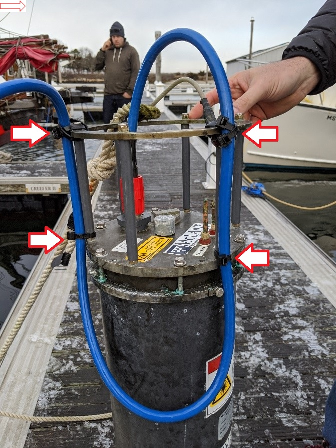
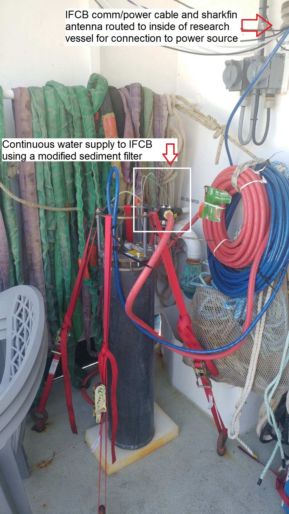

 # 5. IFCB Field setup types

  The IFCB is a complex instrument, and its specific requirements must be taken into consideration when planning a deployment at a remote or field site. The power requirements, cellular connection and access to a continuous supply of water requires modifications to the IFCB set up suitable for the field site it is being deployed are. Following are a few examples of these setups and important considerations.

  Note: the IFCB power/Ethernet cable is more delicate than it looks. Twisting, kinking, tensile stress etc. can damage communications. The IFCB cannot be suspended using the cable, this will result in damage to the cable, loss of communication and possible detachment and damage to the IFCB.

  ## 5.1. Dockside submerged deployment                                                                                                                                                               

- A NEMA 4 certified junction box has been fitted with shark fin antennae (attached to outside of box, with a port drilled into the side of the box for the cables to pass through), and ports fitted with cable glands that allow snaking the IFCB power cable out of the box, but with rubber stoppers/electrical tape around the cable gland to keep the box as weather proof as possible. The junction box can sit outside on the dock itself if the temperature is not expected to drop below 0℃ or above 40℃ (if using a backup power source inside it). The NEMA-4 box is capable of protecting the contents from falling dirt, rain, sleet, snow, windblown dust, splashing water, and hose-directed water and will be undamaged by the external formation of ice on the enclosure.
- The MP70 is capable of withstanding -20℃ to 60℃ temperatures, but should be kept away from moisture if possible. The power source for the IFCB is very sensitive to moisture and will experience a short circuit if directly exposed to water. It should be kept away from the walls of the junction box to prevent getting any condensation on it. 

- Make sure anode and weight plate are attached to the bottom of the IFCB.
- Remove the silicone tubing from intake and exhaust ports and attach mesh filter tip to the intake, screw on copper anti-biofouling guards to both the intake and outlet of the IFCB; using the mesh ended copper guard on the intake and the straight copper guard on the exhaust.
- Make sure a power/communication cable of appropriate length is chosen and extra length is coiled and zip-tied to avoid kinks and stress. 
- Ziptie the power cable to the top of the IFCB using 4 points of connection and giving plenty of slack so that there is no stress on the cable when deployed.

- Use line to tie the IFCB to a cleat if hanging off a dock, making sure the line and power/communication cable do not get entangled.
- Follow instructions in “Starting up the IFCB” on starting up the IFCB before putting IFCB in the water.

## 5.2. Dockside surface deployment

- The IFCB will need continuously circulated water that will be pumped up to it for the duration of the sampling.
- The IFCB will need to be tethered to a surface free of vibration, preferably in an enclosed space such as a shed. 
- A similar set up to the dockside submerged deployment can be used to house the power supply box, backup power box and modem/router and attached antenna so it can be protected from the weather. The NEMA-4 box is capable of protecting the contents from falling dirt, rain, sleet, snow, windblown dust, splashing water, and hose-directed water and will be undamaged by the external formation of ice on the enclosure. The sharkfin antenna can withstand exposure to the elements, but the 6 cable connections to the modem will need to the protected from moisture.
- The communication/power cable should be routed from the NEMA-4 enclosure to the IFCB, with minimal kinks and twists and excess length should be coiled and ziptied.
- A hose with filter setup, similar to the one used in the shipboard setup can be used to attach the intake and outlet tubes of the IFCB to it. 

- One end of the hose should be submerged in and secured to a container being pumped continuously with water from the sampling source and the other end of the hose can be secured to pump the exhaust to an appropriate drain. 

- When experiencing a bloom or when there is too much large debris in the seawater flow through, a sediment filter (https://www.amazon.com/dp/B008Y2O8AY?psc=1&ref=ppx_yo2_dt_b_product_detailscan) can be modified and plumbed with IFCB PEEK tubing fitted with an intake mesh filter and used as a first filter to preserve the more delicate nitex mesh filter tip on the intake from damage.

  

  

- Once the IFCB is secured, with water flowing continuously through the hose and being discarded from the exhaust end follow the instructions in section “Starting up the IFCB”

## 5.3. Shipboard deployment

- The IFCB needs to be close to an uncontaminated, continuously flowing seawater source that will be flowing for the duration of the cruise.
- The IFCB will need to be protected from the vibrations of the ship as this can cause misalignment. Use ratchet straps and bungee cords to tie down the IFCB making sure that there is ample foam padding between the IFCB and ship surfaces. 
- Option 1 When a sink with continuous seawater flow through is available: Attach one end of the hose with the filter to the continuous seawater source and attach the other end into a large-mouthed bottle or similar container which will rest inside a sink for the continuously flowing seawater disposal. Ziptie the IFCB inlet tubing with a filter tip (using the green PEEK tubing) as close to the mouth of the hose inside the bottle. Make sure the IFCB exhaust tubing is secured to the inside of the sink and the IFCB power source is kept away from the splash zone of the sink as it is very sensitive to water and may short circuit and/or catch fire.

- Alternatively the IFCB can be set up in a sheltered area of the ship with open connections to the inside of the vessel for the power supply box and MP70. This can be done if the continuous seawater supply is only available on the deck or there is limited space inside the cabin. In this case the IFCB should still be secured to the ship with bungee cords and ratchet straps and have foam padding between the ship and all IFCB surfaces. 

  

- A long hose with the PEEK tubes attached to a modified sediment filter can be used to supply IFCB with seawater as well as act as a conduit for the exhaust. The IFCB power cable should be ziptied to the end cap using 4 points of connections to ensure the cable does not kink.

- The MP70 has a 20 ft long antenna cable and the antenna should be placed on the outside of the vessel. Ideally this will be ziptied to an upper deck railing or other high point for maximum cellular network connectivity.

  

  

- Vibrations, shocks, and the IFCB sampling air due to unplanned shut down of the seawater flow through systems are the largest concerns on board research vessels. Some other concerns are availability of space for power and communications equipment. With strategic placement the total footprint of the IFCB can be reduced to 1 sq ft.

  

- Once the IFCB has been secured and the seawater has been overflowing out of the bottle with the hose secured in it follow instructions in “Starting up the IFCB” on starting up and monitoring the IFCB. 
