# 6. IFCB – basic operation for sampling

## 6.1. Starting up the IFCB 

- Once the IFCB is secured in place and continuous water supply has been ensured follow the instructions below. (For dockside submerged operation start the IFCB before submerging in water, but only start sampling once IFCB has been submerged and secured).

- Connect the IFCB Ethernet cable to the router/modem, connect the IFCB power cable to the power box. The IFCB should start up automatically and can be accessed using Windows Remote Desktop when using the Windows OS and VNC viewer when using the Linux OS.

- Logging into the IFCB: The username of all IFCBs is set to "ifcb" by default and the password to log into them is set to the serial number assigned to the IFCB. Remote desktop requires the IP address of the IFCB (LAN/WAN), the username (ifcb), as well as the serial number (MLXXXXX-01) to log in. VNC only requires the IP address (WAN/LAN) and serial number password to log in.

  - LAN connection: When connected directly to the MP70 using wired/wireless connection. Use local IP address 192.168.13.xxx to connect to the IFCB over Remote Desktop/VNC.  

  - WAN connection: When not connected to the MP70 locally or when you are remote to the site of the MP70, connect using remote desktop/VNC with the IP address associated with SIM card used in Modem with port number assigned to IFCB, e.g. 166.xxx.xx.42:(IFCB external port number).
  
- Checking IFCB connection to MP70: Connection to the MP70 is possible using its local network by signing into the Wi-Fi, or by remote connection. Open a browser window and connect to the MP70 using the local IP i.e.192.168.13.31 or the WAN IP  i.e. 166.xx.xx.xx:9443 to connect to the MP70’s ACEmanager where you can check if the IFCB is on the network. Navigate to the **Status** tab > **LAN IP/MAC** table and the connected IFCB should be visible in the table and identifiable by either its IP or MAC address.

  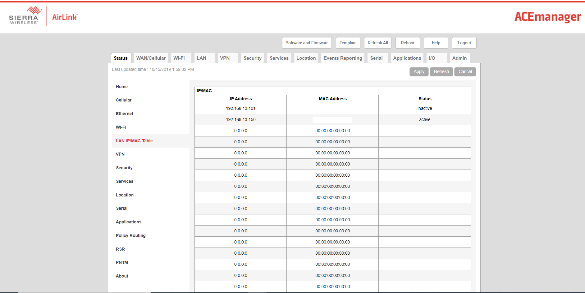
  
- Once connected to the IFCB using remote desktop/VNC the IFCBacquire software will have started up 60 seconds after boot up. If the syringe has been set to zero then the software should start up without the IFCB starting sampling in the Windows OS. In Linux unless autostart is selected in the menu the IFCB will not start sampling automatically regardless of the number of syringes set. Introducing air into the IFCB should be avoided as it requires many samples to work its way out and will hamper imaging and flow.

### 6.1.1. Basic operations using the Windows OS

- Once connected by remote desktop the IFCBacquire software will have started up 60 seconds after Windows boot up. If the syringe has been set to zero then the software should start up without the IFCB starting sampling. Introducing air into the IFCB should be avoided as it requires many samples to work its way out and will hamper imaging and flow.

- Navigate to the **Hardware** tab and note the **humidity and temperature**. This will have changed after transport from the lab.

  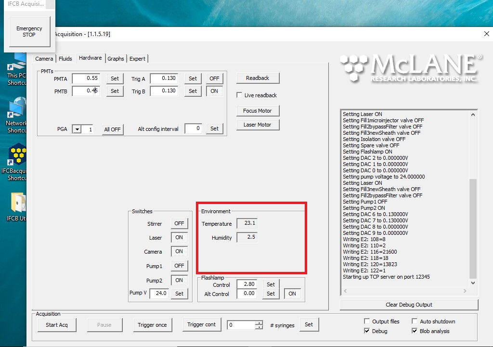

- In the **Hardware** tab check the PMT settings: PMTA should be set to 0.45-0.65, PMTB should be set to 0.45-0.70. Trig A and Trig B should be set between 0.120- 0.140. These settings are very subjective to the environment being sampled, and also on the laser/PMT hardware individual to each instrument. The settings should be set to a range that is giving uniform PMT signals across the flow cell and producing a zero ROI every 12-15 triggers.

  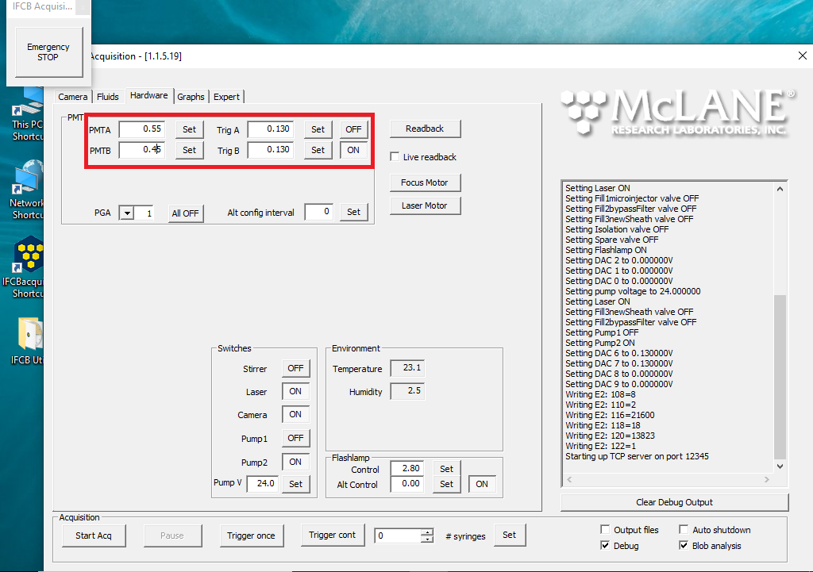

- In the **Hardware** tab check if the **Laser, Camera and Pump 1 or 2** are set to **ON** and set to 14 v/24 v depending on the age of the pump motors. Check if **Flashlamp** is set to **ON**.

  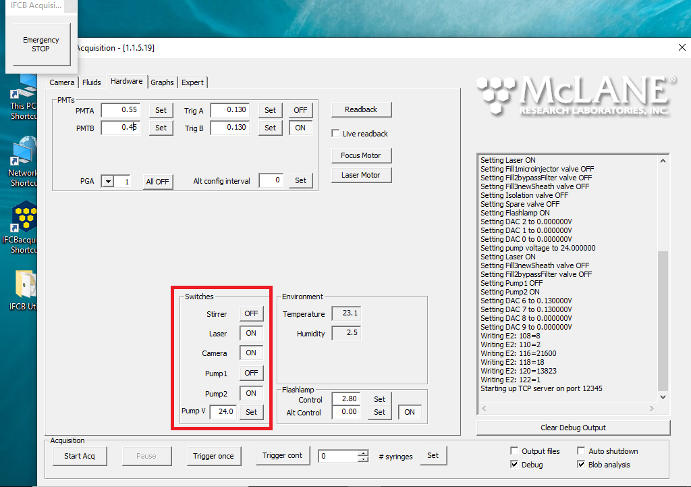

- Navigate to the **Fluids** tab and check if **Active, Refill after debubble and debubble with sample** are selected. Set sample volume to 5.0 and Beads interval to 60.

  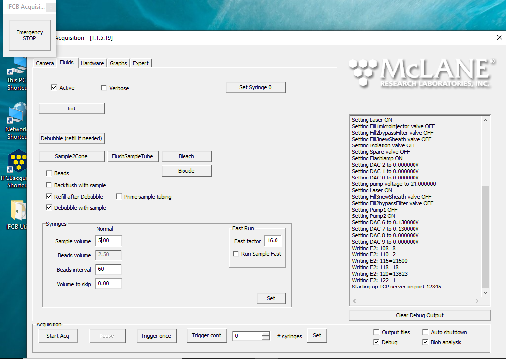

- Navigate to the **Camera** tab and set **# syringes** to appropriate number (10,000 if long term sampling, sampling at the rate of ~60 samples/day). Select **Output files, Debug and Blob analysis**.

  If setting up a dockside submerged IFCB at this point lower the IFCB into the water and secure vertically at appropriate height to ensure that it remains submerged even at low tide.

  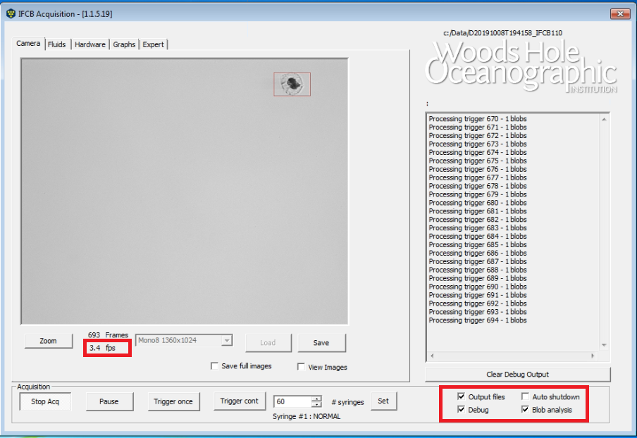

- Start acquiring samples and note the fps rate in the **Camera** tab. Look at the roi triggers in the Activity pane adjust the PMTB voltage until you are getting a 0 blob every 15-20 blobs, this is usually is the range of 0.65 to 0.75 volts. Look at the ROIs in the Camera window and make sure they are well focused. Focus can be adjusted by very small increments using the **focus** **motor** controls in the Hardware tab. Use the Large step << and >> icons to move in one direction at a time to adjust focus.

  

- Navigate to the **Hardware** tab and note the humidity and temperature for the duration of two samples. The temperature inside the IFCB will fall/rise according to the ambient temperature, but should not change more than a few units post-canning. Uncheck **View Images** after monitoring flow and images for a few samples to free up processing speed.  

- The graphing function takes a lot out of the CPU, but is useful to keep an eye on the flow.  Navigate to **Graphs** next to the **Hardware tab**, and select graph type **RoiXY**. The ROIs should be triggering within the area in the box in next figure.

- Refer to section 7 for daily check in and long-term maintenance.

  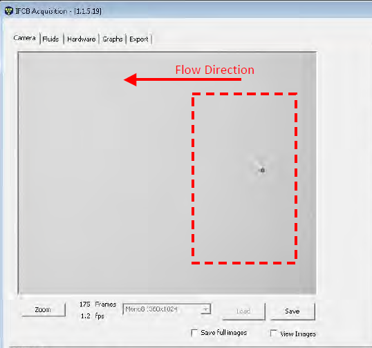

### 6.1.2. Basic Operations using the Linux OS

- The IFCBacquire software in Linux has three main components: the server, Host, and the WebUI

  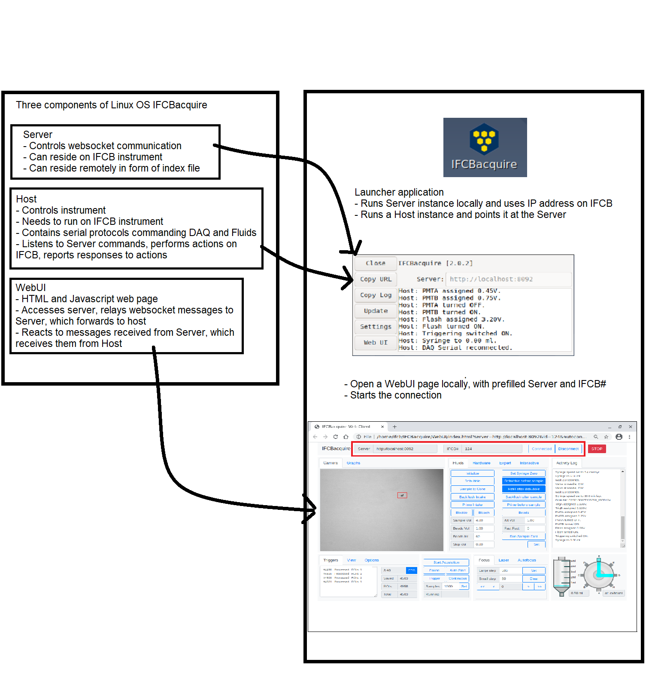

- Once the IFCB is secured in place and continuous water supply has been ensured follow the instructions below.

- Connect the IFCB Ethernet cable to the router/modem, connect the IFCB power cable to the power box. The IFCB should start up automatically and can be accessed using  VNC viewer when using the Linux OS.

- Logging into the IFCB when using modem: VNC only requires the IP address (WAN/LAN) and serial number password to log in.

  - LAN connection: When connected directly to the MP70 using wired/wireless connection. Use local IP address 192.168.13.xxx to connect to the IFCB over Remote Desktop/VNC  (setting up the IP address for IFCBs is detailed in earlier section).

  - WAN connection: When not connected to the MP70 locally or when you are remote to the site of the MP70, connect using remote desktop/VNC with the IP address associated with SIM card used in Modem with port number assigned to IFCB, e.g. 166.xxx.xx.42:(IFCB external port number).

- Logging into IFCB using router:

  - Connection to the Netgear router is possible using its local network by signing into the Wi-Fi using a laptop. 

  - Open a browser window on a laptop connected to the Wi-Fi network of the browser and use the IP address of the router: 192.168.1.1 to connect to the Router where you can check if the IFCB is on the network. 

    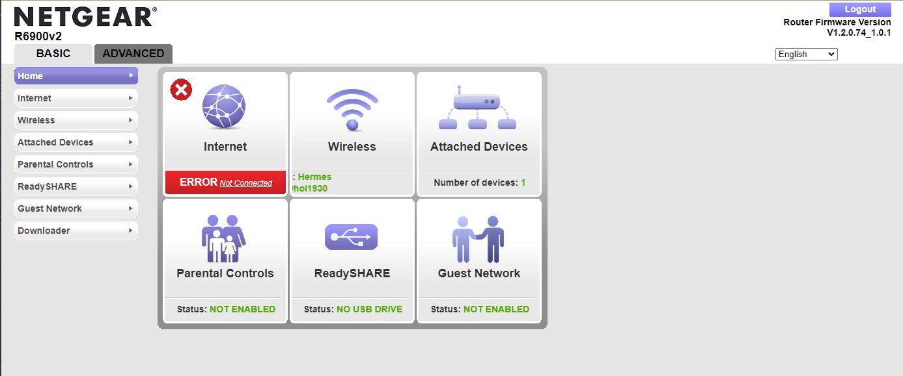

- The IFCB will have started up in the Linux OS. Open VNC on the same laptop to connect to the IFCB using the IP address i.e. http://192.168.1.xxx, and the password which is the serial number assigned by McLane (i.e. MLxxxxx-01), which is printed on the top of the IFCB.

- The IFCBacquire software will have started up 60 seconds after boot up and the main debug windows will be up on the desktop. Click on **WebUI** to start up the full user interface in Chromium, if it has not already started up. 

  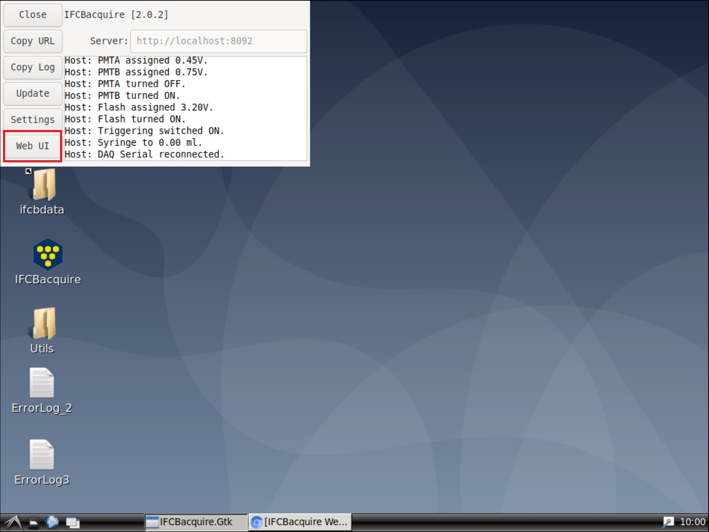

- Navigate to the **Hardware** tab and note the **humidity and temperature**. This will have changed after transport from the lab. Also make sure the **Live** button above humidity and temp is not highlighted since this makes the software die. The software updates the temperature and humidity readings every minute or so. Both of these readings are relative to the initial readings and will fluctuate according to the external temperature, and temperature of the water being samples. If temperature exceeds 35C the IFCB should be turned off as this can damage the CPU. If humidity rises more than 10% from initial reading it might indicate a leak in the reagent bags/syringe/internal fluidics and the IFCB should be monitored. Turn off the IFCB if humidity exceeds 60%.

  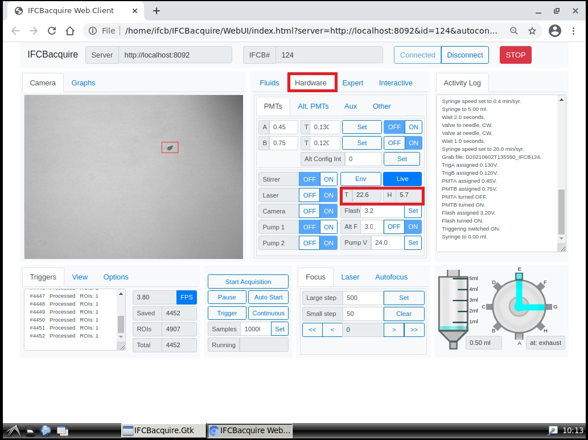

- In the **Hardware** tab check if the **Laser, Camera and Pump 1 or 2** are set to **ON**. Check if **Flashlamp** is set to **ON**. Only one pump should be on at any given time, the other one is designated as the back up pump.

  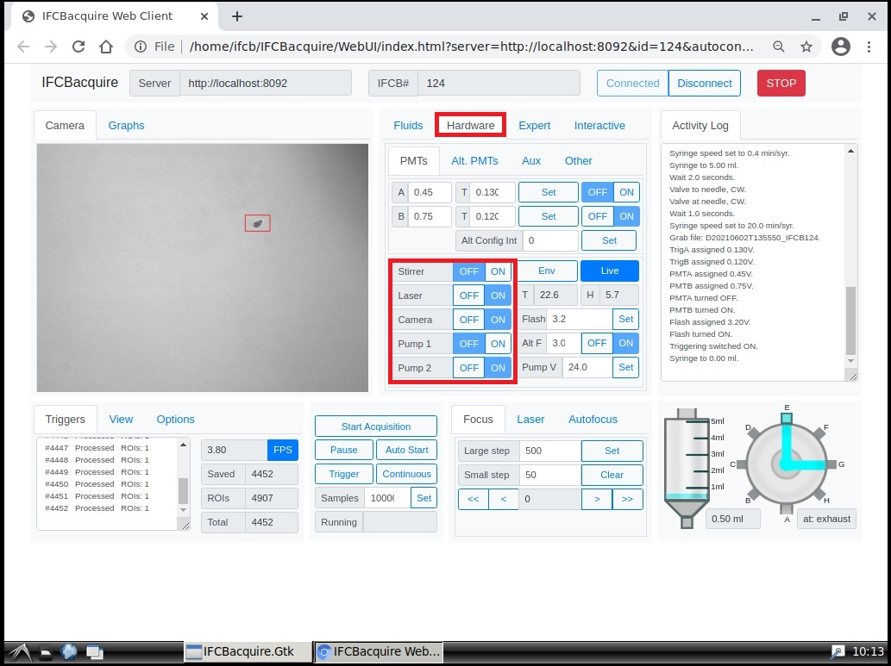

- Navigate to the **Fluids** tab and check if **Refill after debubble and debubble with sample** are selected. Check if **sample volume** to is set to **5.0** and **Beads interval** to **60**. If making any changes in this tab make sure to click **Set** to apply changes.

  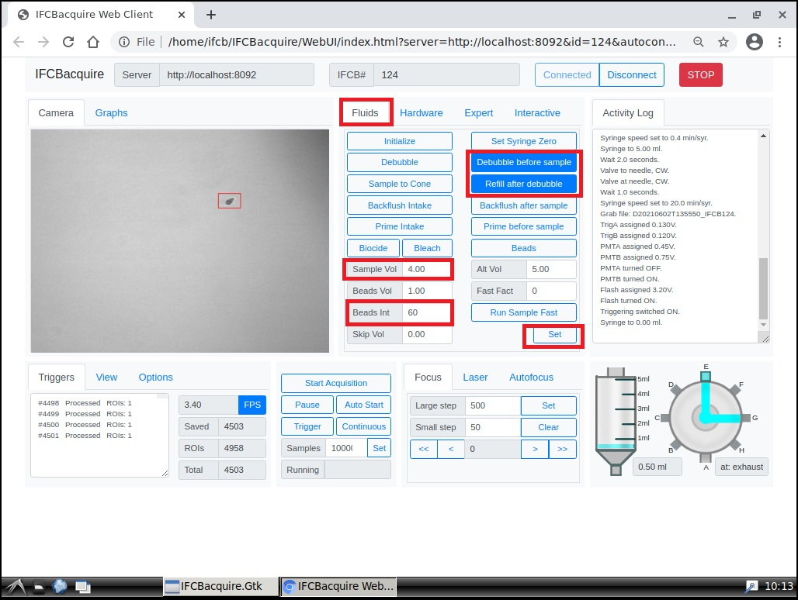

- Set **Samples** to appropriate number (10,000 is upper limit, sampling at the rate of ~60 samples/day when sampling volume is set to 5 ml). Click **set**.

  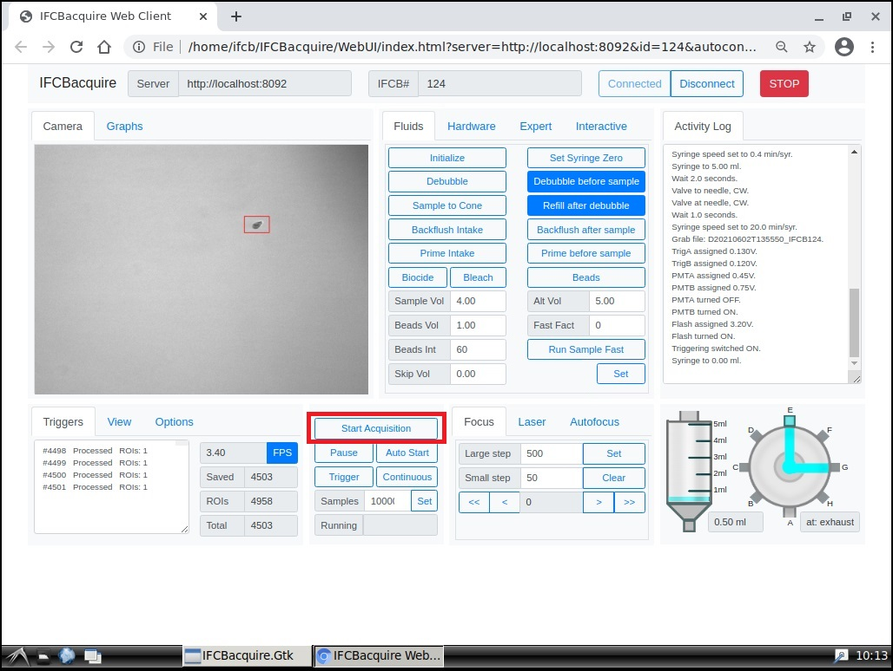

- Start acquiring samples by clicking on **Start acquisition**. Make sure the intake and exhaust lines are submerged in sampling water before hitting start.

  If setting up a dockside submerged IFCB at this point lower the IFCB into the water and secure vertically at appropriate height to ensure that it remains submerged even at low tide.

  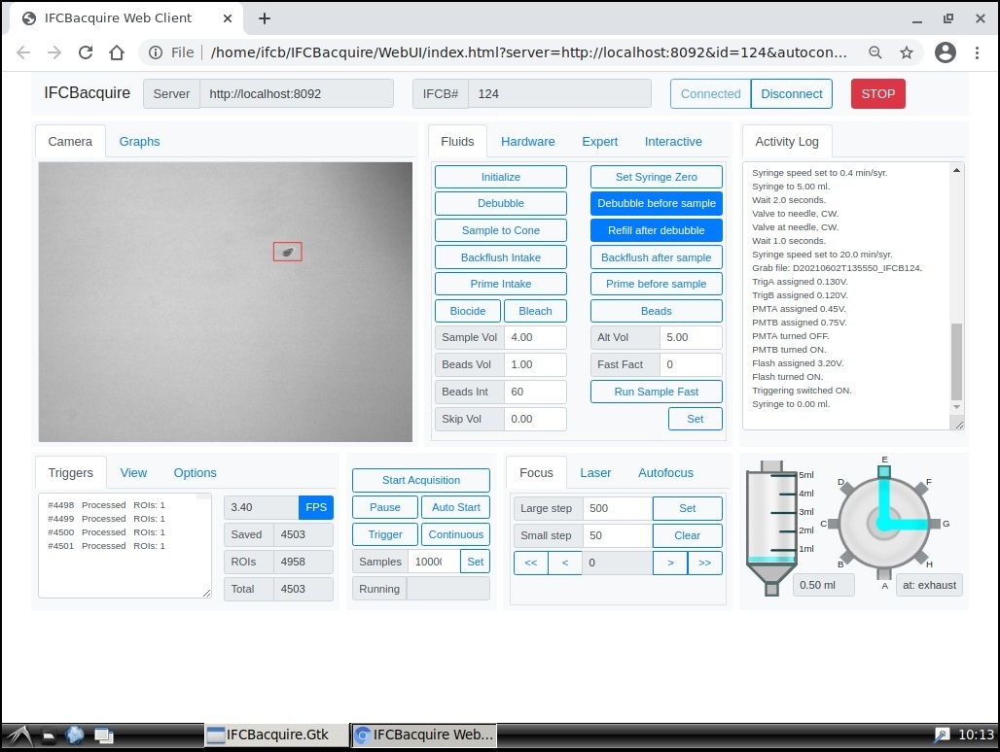

- Navigate to **View** and **select Images, Triggers, Valve, Activity, Syringe**. When selected these will be highlighted blue and the Camera view screen will show images of ROIs once the IFCB starts sampling after a 3 minute debubble run. 

  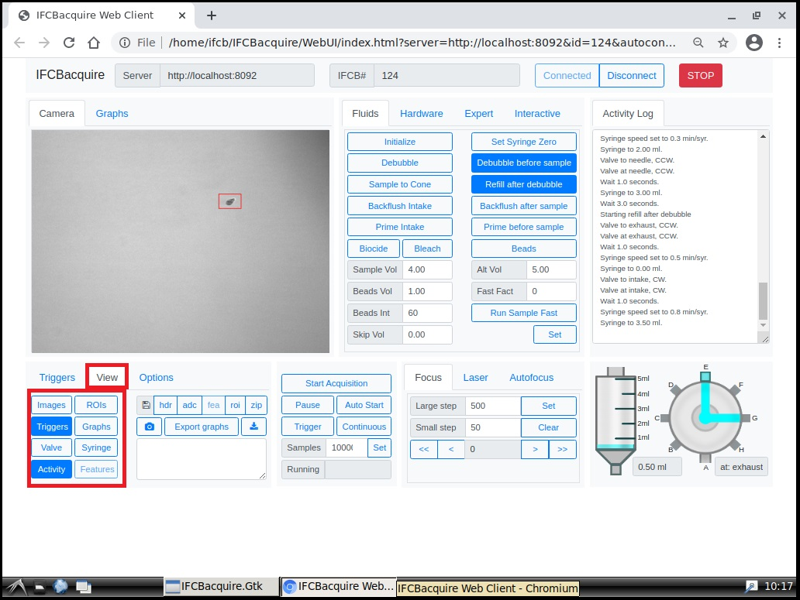

- The status of the syringe and valve will be visible in the lower right corner. The sample run will start once the syringe has filled up to 5 ml volume and the valve is at Needle position.

- Look at the ROIs in the Camera window and make sure they are well focused. Focus can be adjusted by very small increments using the **focus** controls. Use the Large step << and >> icons to move in one direction at a time to adjust focus.

  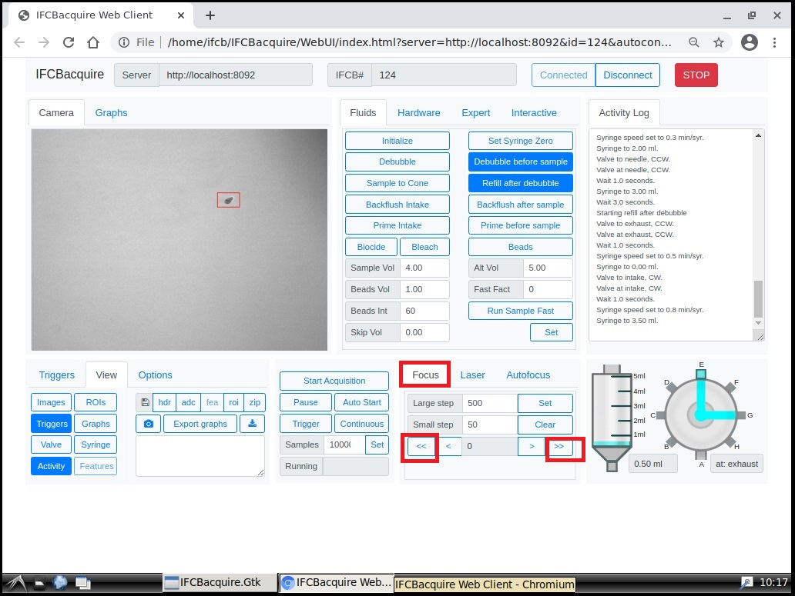

- Once the IFCB is set up for sampling uncheck the Images, Valve and Syringe icons to save CPU space.

- Navigate to the **triggers tab** and check if you are getting a **zero ROI** every 15-20 ROIs and an fps between 3.00 to 11.00 

  

- The **PMTB setting**s under the **Hardware tab** can be bumped up to 0.70-0.75 to make sure the laser sensitivity is optimum. Click **set** under the PMT settings after making any changes to these specific settings.

  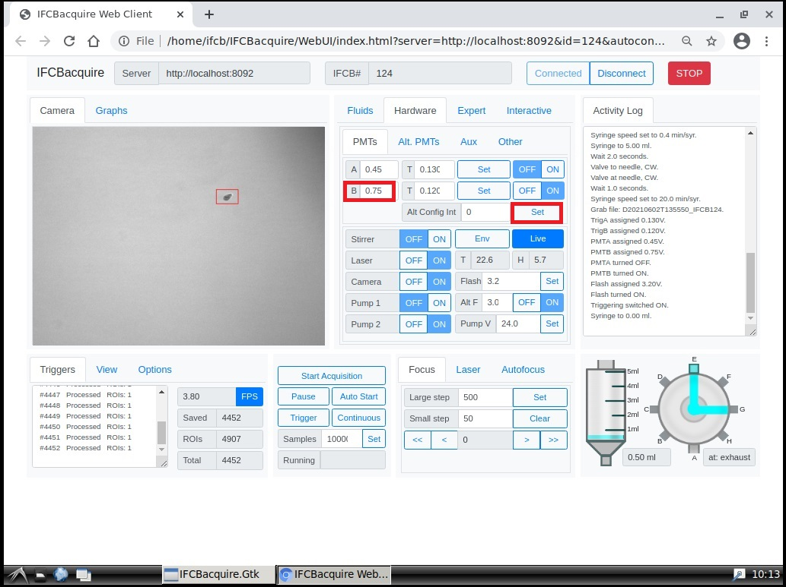

- If needed to move from PMTB to PMTA in open ocean waters navigate to Hardware tab and select **On** next to PMTA and bump up PMTA settings to the 0.65-0.70 until you start seeing a zero ROI under **Triggers** every 20 triggers. Turn PMTB to **Off** and click **set**.

  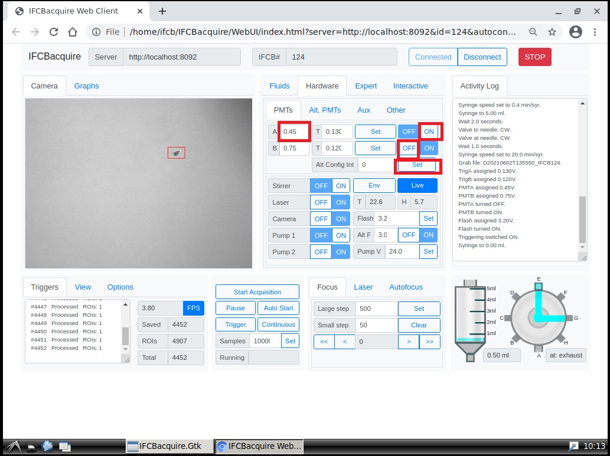

- The IFCB will need to be checked on every 24 hours or so. Main things to keep an eye on is the humidity and temperature, check images are still in focus and make sure the flow cell is not clogged. See end of document for daily checklist.

- The graphing function takes a lot out of the CPU, but is useful to keep an eye on the flow. Navigate to the **View tab** and select **graphs**. Navigate to **Graphs** next to the **Camera tab**, and navigate to tab **RoiXY. The** ROIs should be triggering within the area in the blue box in next figure.

  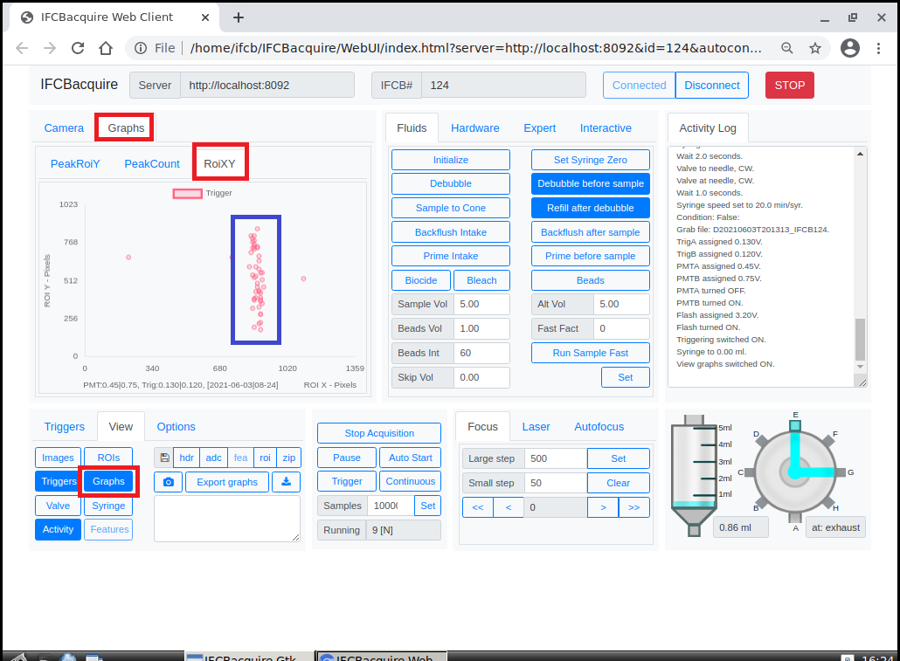

- If using GPS location in conjunction with a pre-configured MP70 (see cell modem setup) open the settings file from the main IFCBacquire window or from the IFCBacquire Host folder. Scroll to the bottom of the file to find the GPSFeed setting and edit it from 0 to 1:22335. Confirm from the MP70 AceManager that the "Report Server 1 Port number" is 22335, if not then use the port number the modem is assigning. Save and close file, reboot IFCB. 

  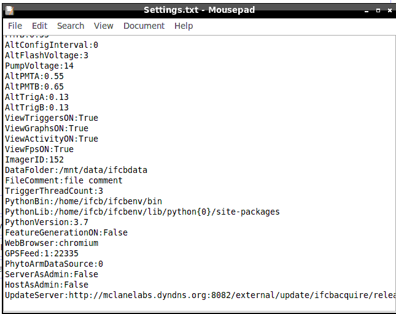
  
- Open the **Hardware** tab on IFCBacquire click on **Other** and click on **Get**. The IFCB should be getting a GPS location from the Modem.

  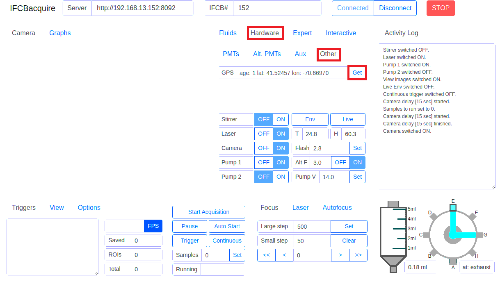
  
- If using the index file to connect to the IFCB, open the index file on the laptop that is connected to the router wi-fi and use the IP address and port number 8092 as **Server**. e.g. for our router this will be http://192.xxx.x.xx5:8092 and IFCB number xxx. Then click on **connect**. The index file looks identical to the WebUI, but having both connected to the IFCB at once can cause it to crash.

  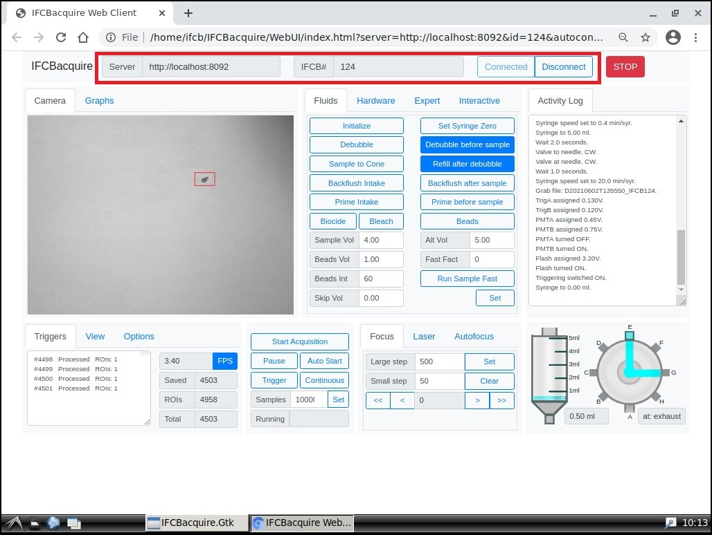

### 6.1.3. Basic Operations using Dockerized IFCBacquire with "headless" CPU (NVIDIA, Versalogic, ADLink with WHOI IFCBacquire + PhytO-ARM image)

The containerized version of IFCBacquire can be cloned and installed from https://github.com/WHOIGit/Dockerized-IFCBacquire 
The docker container contains the IFCBacquire Linux OS 3.0 build released by McLane Labs in 2024 and once installed will contain the same 3 components of Host, Server and WebUI. The "headless" CPU refers to a Linux Ubuntu 10 OS that can be navigated using command line and has no graphics user interface (GUI). 

IFCBacquire does not natively start upon startup of the OS. Instead once a connection has been made to the IFCB (either using an IP address and an ssh connection or using a connected monitor and mouse), the software needs to be started in a Tmux session in order to keep the IFCBacquire host and server on when navigating away from the software to use other components of the OS. A Tmux cheatsheet can be found here: https://tmuxcheatsheet.com/ A description of what Tmux is can be found here: https://tmuxcheatsheet.com/how-to-install-tmux/

- Log into the IFCB using an ssh connection and password from Terminal if using Mac or WSL (Windows subsystem for Linux) if using Windows
   ```
  ssh ifcb@128.128.191.xxx
  ```
- Start a new Tmux session by typing and hitting return
   ```
  tmux new -s ifcbacq
  ```
  This will open a tmux window which can now be used to start IFCBacquire and look at the Host commands. In the tmux window type the following to start IFCBacquire and hit return at the end of each line of code
   ```
  cd Dockerised_IFCBacquire
  ./run.sh 
  ```
- Once the host window is up and running IFCBAcquire's webUI can now be accessed from a computer with a GUI. To disconnect from the Tmux session and keep it running in the back ground use ctrl+b+d. This will take you back to the command line interface of the ifcb folder on the IFCB. 
- Open the webUI browser window on the computer you are connected to and follow instructions in 6.1.2 for basic use of IFCBacquire.
- To stop IFCBacquire stop sampling in the IFCBacquire webUI or PhytO-ARM command line and run a few bleach and biocide routines from IFCBacquire webUI. Then in the terminal/wsl connect to the IFCB using an ssh connection and use the following
   ```
  tmux kill-session -t ifcbacq
  ```   

## 6.2. Stopping the IFCB after sampling

- Cleaning should be performed each time the IFCB has been used for an extended period of time, or between sampling different environments to avoid carryover. To clean the instrument run the following steps twice, repeating for each pump that was in use for samping. Note: Make sure the intake tube is submerged in fluid or appropriate salinity (or MQ water) since the IFCB will need fluid for flushing after a run of cleaning agents.

  Under the **Fluids** tab click **Bleach** to run the detergent solution of 1% Terg-a-zyme and 5% Contrad.

  Under the fluids tab click **Biocide** to run the Sodium Azide solution.

  Leave the pumps running for 15-20 mins after these cleaning runs without running fresh samples.

  Note: If cleaning has to be done after a long term installation this can be done by sampling the cleaning solutions to the intake tube in case reagent bags have been depleted.

- Make sure to wait for acquisition to finish or “**Stop acquisition**” or the sample file will not be saved. Set **# syringes** to **0** and close IFCBacquire using the emergency stop button.
- Turn off IFCB from the start menu.

- Follow the steps in the McLane labs manual for long-term storage of the IFCB without sampling to avoid water stains on the flow cell or salt buildup.
