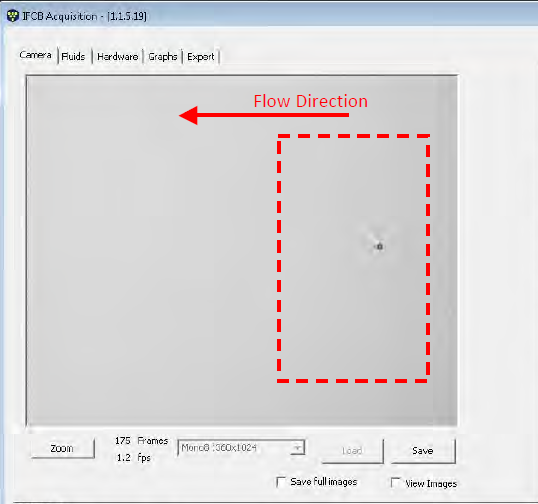
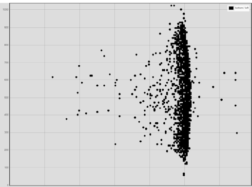

# 7. IFCB routine assessment, daily check-ins

## 7.1. Daily Check in

- Check that the acquisition is running and output files box is checked.

- A daily check in to monitor the temperature and humidity inside the pressure housing is good practice. The humidity after canning should stay consistent within a few percentage points, a large rise in humidity is an indication of a leak and should be addressed immediately. Temperature over 40 ℃ inside the pressure housing of the IFCB can result in damage to the computer stack and should be addressed immediately.

- Check images on the dashboard for:

  - Position in flow cell: Are the ROI’s being captured in the optimum part of the flow cell

  

  - Focus: Are the images sharp and in focus?
  - Lighting: Any changes to the lighting can be an issue with the camera
  - Bubbles/debris in flow cell
  - Uncheck **View images** after check in.

- A check in to monitor the fps rate and ROIs/trigger is also good practice.

  - If many zero ROI’s are being observed or multiple ROI’s are being captured for every trigger it may indicate issues with debris/bubble in the flow cell, ineffective filtering of large particles that can clog up the flow.

  - Low fps rate (0-0.6) can indicate inefficient PMT settings. PMTB settings should be adjusted to a suitable value to get a zero ROI every 15-20 images.

- A visual inspection for buildup on the filter tip on the intake should be performed, biofouling of the tip can lead to clogging of the flow cell eventually.
- The Windows 10 automatic updates can cause reboot of the OS after updates are installed. As long as Task Scheduler is set up to auto-start IFCBacquire 60 seconds after reboot the IFCB should start sampling again after a reboot event. It is good practice to log in to the instrument and check these logs from time to time. 
  - Search for “Run” in the Windows Start menu, type “eventvwr.msc” into Run and click OK to open Event Viewer.
  - In the left pane of Event viewer, Under “Windows Logs” right-click on “System”, Click on “Filter current log”.
  - In the new dialog that opens enter 41, 1074, 6006, 6008 in the field called **All Event IDs**. Click OK.
  - This will bring up a log of all reboot/shutdown events and can be used to monitor any interruption in IFCB sampling.

- If frequent reboots become an issue automatic updates can be paused temporarily by going into Start>Settings>Update & Security>Advanced options> Pause updates. This can pause automatic updates for up to 35 days.

- If more control is required over when updates are installed and the system rebooted, settings can be changed in Group Policy settings.

  - Search for gpedit in Windows search bar, open Group Policy editor

  - Computer Configuration\Administrative Templates\Windows Components\Windows Update

  - Double-click the Configure Automatic Updates policy on the right side.

  - Check the Enable option to turn on the policy.

  - In the "Options" section, you'll find several options to configure automatic updates, including:

    2 - Notify for download and auto install.

    3 - Auto download and notify for install.

    4 - Auto download and schedule the install.

    5 - Allow local admin to choose setting.

    The closest option to disable automatic updates is the 2 - Notify for download and auto install option, but you can select any other option that best fits your situation.

  - Click the Apply button.
  - Click the OK button.
  - After completing the steps, updates will stop downloading automatically. However, when a new update becomes available, you'll receive a notification to download and install updates manually from the Windows Update settings page.
  - Monthly installation of updates should be scheduled and the system should be allowed a controlled reboot.

## 7.2. Long-term check-ins

- Biofouling can occur on the nitex filter tip of the IFCB on long-term deployments. Selecting **Back flush with sample** under the **Fluids** tab can help to clear clogs on the filter tip on remote installations. Installations with regular access should be monitored for biofouling regularly.
- Data being stored on the hard disk of the IFCB should be monitored regularly. If the hard disk runs out of space IFCBacquire will not collect any more samples. Data should be periodically moved off the IFCB to avoid interruptions.
