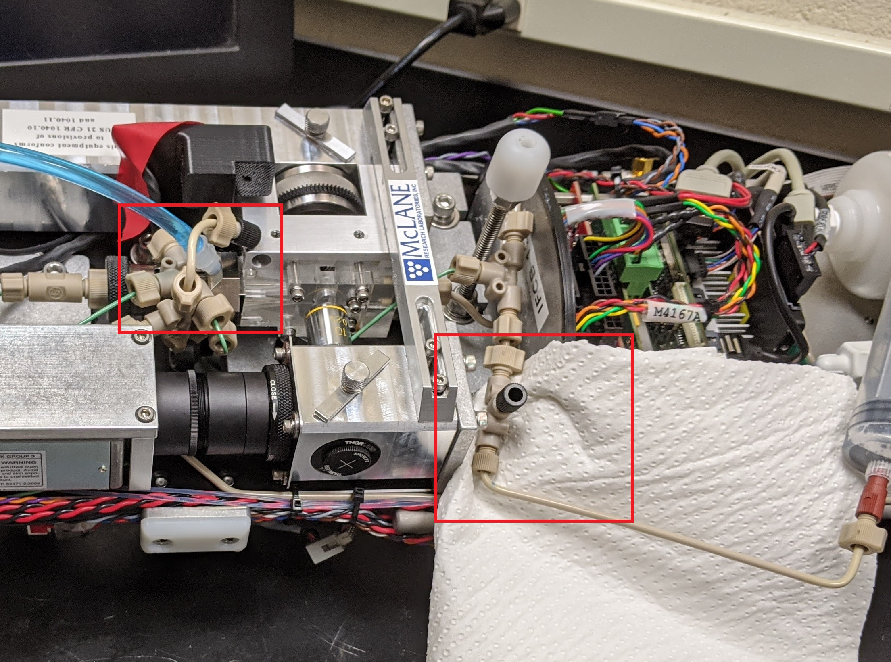
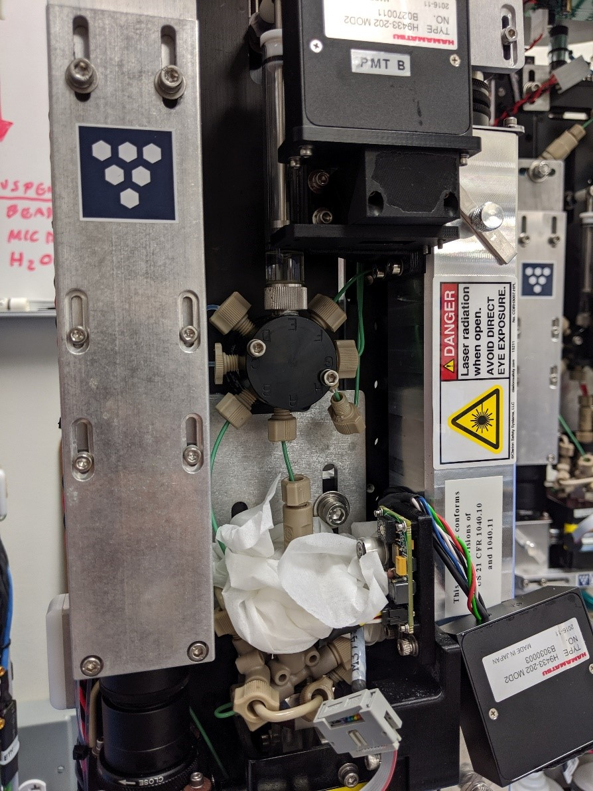

# 8. IFCB common issues, known problems and how to manage

## **Issue: Sudden spike in image files on dashboard, duplicate images, same spot being captured as ROI:**

Solution: Clean the flow cell

\-    Option 1: For Remote installations 

a.   Stop the IFCB sampling, go into the **Fluids** tab and run the **Bleach** cycle, stop the **Bleach** cycle using the emergency stop function before the detergent solution is pushed back out of the sample intake. Then use the “**Sample to Cone**” command under the **Fluids** tab to push the detergent to the flow cell. Leave the detergent in the flow cell for 15 mins. Run a few **fast samples** and alternate with **debubble** cycles.

\-    Option 2: If IFCB is accessible:

a.   Run a sample of 2% Micro-90 and when the sample reaches the flow cell, turn the pumps off and pause sample and let it sit in the flow cell for 15-20 mins. **Initialize** sample (to empty syringe) and run 2-3 samples with **fast sample run** selected. Perform several alternating deubbling and “run sample fast” cycles. (Taylor Crockford from Google user group). 

b.   Run samples of 10% HCl through the sample intake tube alternating with fast runs of filtered sea water or MQ water depending on salinity of sheath fluid.

c.   If the clog is very stubborn a Tee connector with some PEEK tubing can be attached to where the flow cell connects to manually run detergent through the flow cell (See instructions under Stains on flow cell).

## **Issue: IFCB sampled air, position of ROI’s is random (all over flow cell)**

Solution: Bad ROI position can be often caused by poor flow or air in the fluidics. This can be checked in the dashboard by setting the view to “plot” and looking at the position of the ROI’s being captured. Debubbling can get rid of small amounts of air in the fluidics, but running many back to back debubbling cycles can cause degassing in the instrument. Taylor Crockford recommends: running alternate debubble cycles and a sample run with “fast factor” selected and set to 15.

This issue can also be caused by a small air bubble stuck in the flow cell. Running a sample of 2% Micro-90 solution can help by changing the surface tension inside the flow cell/cone.

\-    Turn off sheath and have the IFCB sample 1-2 ml of 2% Micro90 solution.

\-    With the sheath still off, run 2 debubble cycles.

\-    Start a sample with water (matching salinity of cartridge) on the fast setting and turn on the sheath after the sample starts running through the flow cell.

\-    Run 1 debubble cycle with the sheath on

\-    Run 5-6 samples of 5 ml filtered seawater/MQ water.

## **Issue: Acquisition restarts with no/few ROI’s or after incomplete** 

Solution: The default time for each sample run is 90 secs and if no triggers are received the system times out and discards the current sample. Double check if sample intake tubing is correctly positioned and getting adequate supply, run a sample of beads and check the position of the ROI’s. This is often an indication that the horizontal laser alignment is off. Can find further discussion on this issue in the IFCB user group on Google groups and the University of Maine IFCB protocol.

## **Issue: Stains on flow cell**

Solution: For IFCB’s that have been sitting dry/stored without running samples for a long time water spots and stains on the flow cell can become an issue. A solution is to rinse with detergent or a glass cleaner like 10% HCl solution in small samples of 1 ml and monitor the flow cell for improvements. 

For stubborn stains a dilute solution of Micro90 with MQ water can be used to manually clean the flow cell:

\-    Shut down the IFCB off and remove power cord and lay the IFCB on its side with the laser and flow cell facing upwards. The IFCB may need to be braced by something to keep it in a stable position.

\-    Remove the focus motor assembly, circuit board and laser cover.

\-    Attach a syringe filled with 60 ml detergent solution nd 40 ml air to the top of the flow cell (Figure ), attach a second similar syringe to the Tee connector under the flow cell. Cap off disconnected connectors with black caps. Use paper towels or other absorbent materials to protect the housekeeping board and other circuitry in case of leaks.

\-    Use the syringes to swish the detergent solution back and forth through the flow cell. The air in the syringes help create shear to remove stubborn stains.

\-    Leave some detergent solution in the flow cell to soak the walls of the flow cell for very stubborn stains. The angle of the IFCB should be changed intermittently so all the surfaces of the flow cell can be soaked in the detergent solution.

Note: Swishing around the detergent will cause some of the detergent solution to come out of the exhaust of the IFCB. Place a container to catch this detergent waste, or disconnect the exhaust connection from the Tee connection.

\-    Once the flow cell has been sufficiently cleaned by this method set the IFCB up vertically for sampling again and run a few 1 ml samples of detergent solution through the intake alternating with debubble samples to clean any obstructions in the needle leading to the flow cell.

## **Issue: Bad flow, ROI’s appear spread out over large area, when running beads some beads appear in focus and others do not.**

Solution: This is indicative of bad flow. Either the needle leading to the flow cell has an obstruction or there is an issue with a pump. Try changing from active pump to inactive pump and monitor the appearance of beads focus. If this does not fix the issues, there may be an obstruction right before the flow cell. Make a dilute solution of Micro90 and MQ water and run small samples of 1ml or less with **Fast sample run** selected, alternating with **debubble** cycles.

## Issue: Grinding noise, rough noise from pumps coupled with bad flow

Solution: This could be an issue with the sheath fluids emptying, pumps or the main valve under the syringe.

1. Sheath containers: Sheath containers should always be full with filtered/purified water of the same salinity as samples. If IFCB has been running samples in a position that is not fully upright it can cause the sheath to be drained. Shine a light on the sheath containers to make sure the containers are full. Open both valves, if not sure. Sheath containers can be disconnected from pumps and flushed with a warm solution of Micro90 and purified water if debris has built up in them. The average life of a sheath cartridge is 5 years. Sheath fluid cannot be replaced once the IFCB is canned.

2. Pumps: Check pump functionality by running a beads solution and checking if both pumps are functioning in the same way. If the position of the beads in the Roi XY graph changes when switching from one pump to another, either the pump or the pump head may be malfunctioning. Check the voltage settings in the Hardware tab. Make sure the voltage corresponds to the requirements of the pump. If pumps are functioning differently disconnect pumps from sheath containers and take them apart to check for debris and to check if the fine wire inside the pump is still intact.

3. Valve: The main valve underneath the syringe can experience failure if the intake is not keeping debris out or if it is very old. To avoid this issue, make sure to run enough bleach/biocide cycles, replace mesh cover on the intake frequently, and listen for the shrieking noise : https://drive.google.com/open?id=1FJlbdgU3-tw-JauBLoWw-QKYLbAiw564

Follow steps below if valve needs to be replaced. Some tools like valve inspection tool may need to be procured from Mclane.

There was a shrieking noise coming from the valve when the IFCB started a sample. Matt from Mclane suggested that the valve was blocked or malfunctioning and needed to be switched out immediately. Example of sound: https://drive.google.com/open?id=1FJlbdgU3-tw-JauBLoWw-QKYLbAiw564

Note: Need gloves for some of this, since the valve is connected to sample, detergent, beads and bleach

1. Turn on IFCB and go to fluids tab. Hit Init to point the valve to the exhaust port and empty the syringe. Make sure syringes are set to “0” and turn off IFCB. Disconnect power supply.

2. Take off PMT A module (4 small screws, using very small hex key)

3. Push lots of paper towels under the valve to make sure any fluid that falls out of it does not get on the circuit boards underneath.

   

4.  Disconnect valve from all connections (Label connections on IFCB A-H to avoid confusion about which goes on where), putting caps on the connections as you take them off, to prevent leakage.

5. Make sure syringe has been zeroed and carefully remove syringe. Follow instructions in manual to remove syringe if unsure).

   

6. Put on gloves. Take off two big screws connecting the valve to the IFCB and carefully take it out.

7. Use valve tool to inspect the valve. The tool fits into the back of valve and you can turn the tool to feel how smooth/rough the ceramic plate and valve connections are. If it feels rough there may be an issue with the ball bearings or ceramic plate inside the valve. Mclane is working on whether you can replace the parts inside the valve rather than replacing the whole valve. When there are particulates stuck in the valve it may be because you are not running enough bleach/biocide cycles, or the mesh cover on the intake is not very effective, or it is just getting old. 

   

8. If replacing the valve put O-rings in all the valve connections (A-H) in the new valve and tamp down using a screw-in connector or similar tool. This is just to make sure the rings do not fall out before the connectors can get screwed back on. IMPORTANT: Push pressurized air through the valve intake and make sure the air is coming out of the G connection. You may need to use the valve tool to realign the valve to make sure the air is blowing strongly out of the G-connection. If the air blows out of any other connection the valve will not fit in place, if the air blows out of the C-connection all the connections will be flipped and the IFCB will push wrong fluids into wrong connections. 

9. Connect valve back on the IFCB, put all the connections back on starting with A and then C (this one is the most difficult to get back on). The connections are finger-tightened, if using a tool be careful not to over-tighten as this can lead to the distortion of the connections and cause leaks.

10. Screw syringe onto the valve tightly, use the motor coupling on the back to align the hole on the plunger with the hole for the shoulder screw. Align the plastic spacer and screw the plunger back on. This step can cause water to shoot out of the outlet so be careful not to let any get on the circuits. Manually turn the motor coupling to bottom out the plunger into the syringe. Once the plunger has reached the bottom, turn the motor coupling back ¼ turn. This is the zero position of the syringe and can be up to 1 mm above the bottom of the syringe.

11. Replace the PMT A module, being careful to align it properly. Make sure all connections have been replaced.

12. Turn on IFCB and go to Fluids tab. Hit “Set syringe 0” to record the zero position of the syringe. Click “debubble (refill if needed)” to purge air from the syringe. Repeat step a few times to get all the air out of the valve and syringe. Check for leaks.

13. Run some MQ on the IFCB and listen to the valve noises, check for leaks around the valve.
