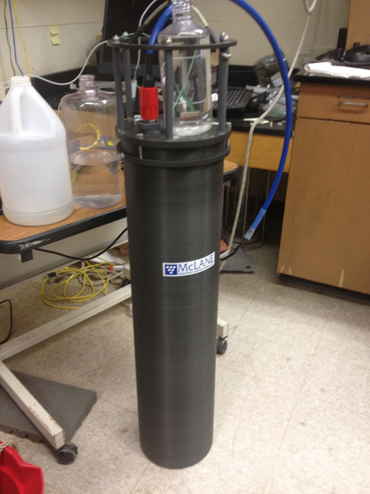
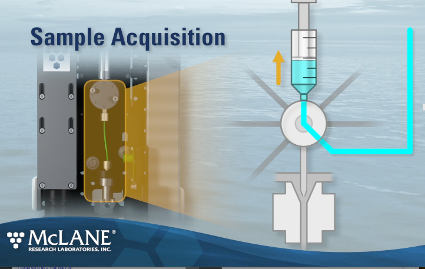

# 1.  Overview

## 1.1. Need for monitoring

Our lab investigates the population dynamics of HAB species by conducting field programs in various habitats, from shallow ponds to open coastal waters. In areas subject to recurrent outbreaks of HABs continuous monitoring is helpful in establishing baseline data on the distribution, dynamics, and eventual fate of algal blooms. The Imaging FlowCytobot (IFCB) is an integral part of our field programs, facilitating remote monitoring of phytoplankton populations and red tide events. To date, we have used IFCBs to collect data in a range of environments ranging from Florida to the Arctic. The IFCB is self-contained and fully submersible, allowing it to be deployed in a variety of field configurations. In the Nauset Marsh system, we use a stationary raft deployment of the IFCB to track the progression of annual red tide events. The IFCB can also be configured to sample from shipboard underway seawater systems, allowing phytoplankton communities to be monitored continuously along cruise routes.

## 1.2. What is an Imaging FlowCytobot? What are capabilities?

The IFCB is an imaging flow cytometer that can be submerged and operated remotely. 

The instrument is designed for continuous, autonomous operation. During a typical deployment, it is programmed to draw 5 mL samples of ambient water by syringe approximately every 25 minutes. The instrument analyzes these samples by injecting them in a narrow stream that is focused via a continuous flow of particle-free sheath fluid. This hydrodynamic focusing mechanism serves two purposes. First, it ensures that particles pass through the instrument’s flow cell within a narrow, ribbon shaped flow path, ensuring that particles in the seawater sample interact with the instrument’s laser beam and then pass through the focal plane of its microscope objective for imaging. This translates to quantitative detection of particles within the seawater samples and ensure that each is imaged in focus. (Instruments like the FlowCAM do not have this hydrodynamic focusing mechanism and therefore particle images are often blurry and therefore much more difficult to identity). The other function of the hydrodynamic focusing mechanism is biofouling prevention. Sheath fluid is continuously filtered through a pair of 0.2 µm filters to remove bacteria and other cellular material introduced via seawater samples. The sheath flow then provides a barrier between sample water and sensitive flow cell surfaces when new samples are injected into the instrument, minimizing the potential for biofilm development on surfaces of the flow cell and other sensitive fluid paths within the instrument. As an added precaution, the system is also designed to periodically inject small quantities of sodium azide (a powerful biocide) into the sheath flow, further reducing the potential for growth by fouling organisms. These aspects of the IFCB’s design enable long duration deployments. IFCBs are commonly deployed in the ocean for many months at a time before maintenance is needed and in some instances for more than a full year of continuous operation.

Particles in seawater samples are detected via fluorescence they produce as they interact with the system’s red laser. If chlorophyll is present, the laser stimulates a fluorescent emission that is detected with a photomultiplier, triggering a flash that illuminates the particle for capture of a photograph. Other particles that do not contain chlorophyll simply pass through the system and are not imaged. 

The rate of image acquisition is a function of the particle concentration in seawater samples. The system injects samples into the imaging flow cell at a rate of 0.25 mL min-1 and can write images to its hard disk at rates of up to 10 s-1. As particle loads increase, the effective analysis rate expressed in terms of volume per unit time decreases. This is because the IFCB system cannot capture new images while writing image data to its hard disk. The sensor’s data acquisition boards account for camera write times and record the effective volume analyzed from each sample. In the highest particle load samples, the system might only effectively analyze <0.25 mL of the 5 mL sample drawn from its ambient water environment.

The specific implementation of random forest we will apply in this project is one developed by IFCB developer Dr. Heidi Sosik. Sosik provides a suite of MATLAB scripts for this implementation via her GitHub repository (https://github.com/hsosik/ifcb-analysis/wiki). This collection of tools also provides helpful scripts for cell boundary detection and calculation of valuable cell metrics (e.g., length, width, biovolume, etc.). Random forest training and classification is based on approximately 200 image ‘features’ (continuously variable characters) that are extracted from individual images via an automated computation pipeline. The raw images and these features can then be made available publicly via an associated data dashboard which has been developed by Joe Futrelle and is also available via GitHub (https://github.com/joefutrelle/ifcb-dashboard/wiki).

## 1.3. Where are we deploying it?

The IFCB is being deployed by our lab at strategic locations along the coast in areas of frequent recurrences of HABs, and/or near valuable resources that may be sensitive to HAB impacts (e.g. shellfish aquaculture farms). Generally the instrument is deployed in the water, or on board research vessels where the instrument has access to a continuous flow of water to sample.

## 1.4. Sensor requirements

The basic requirements for the IFCB are: continuous power supply of 35W, internet connectivity for continuous data transfer to the order of 1 Gb/day of raw image data (this is variable depending on the environment it is sampling), and a workstation for data transfer and image analysis (this can be remote from the IFCB deployment). 
