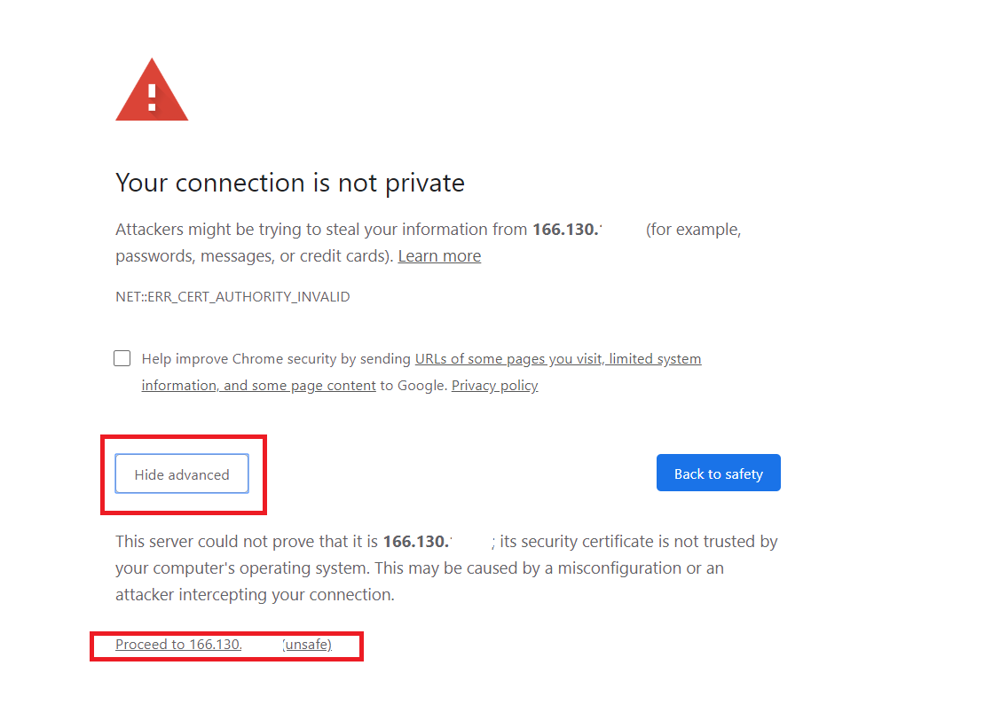

IFCB Introduction and Field Deployment

# 1.  Overview

## 1.1. Need for monitoring

Our lab investigates the population dynamics of HAB species by conducting field programs in various habitats, from shallow ponds to open coastal waters. In areas subject to recurrent outbreaks of HABs continuous monitoring is helpful in establishing baseline data on the distribution, dynamics, and eventual fate of algal blooms. The Imaging FlowCytobot (IFCB) is an integral part of our field programs, facilitating remote monitoring of phytoplankton populations and red tide events. To date, we have used IFCBs to collect data in a range of environments ranging from Florida to the Arctic. The IFCB is self-contained and fully submersible, allowing it to be deployed in a variety of field configurations. In the Nauset Marsh system, we use a stationary raft deployment of the IFCB to track the progression of annual red tide events. The IFCB can also be configured to sample from shipboard underway seawater systems, allowing phytoplankton communities to be monitored continuously along cruise routes.

## 1.2. What is an Imaging FlowCytobot? What are capabilities?

The IFCB is an imaging flow cytometer that can be submerged and operated remotely. 


The instrument is designed for continuous, autonomous operation. During a typical deployment, it is programmed to draw 5 mL samples of ambient water by syringe approximately every 25 minutes. The instrument analyzes these samples by injecting them in a narrow stream that is focused via a continuous flow of particle-free sheath fluid. This hydrodynamic focusing mechanism serves two purposes. First, it ensures that particles pass through the instrument’s flow cell within a narrow, ribbon shaped flow path, ensuring that particles in the seawater sample interact with the instrument’s laser beam and then pass through the focal plane of its microscope objective for imaging. This translates to quantitative detection of particles within the seawater samples and ensure that each is imaged in focus. (Instruments like the FlowCAM do not have this hydrodynamic focusing mechanism and therefore particle images are often blurry and therefore much more difficult to identity). The other function of the hydrodynamic focusing mechanism is biofouling prevention. Sheath fluid is continuously filtered through a pair of 0.2 µm filters to remove bacteria and other cellular material introduced via seawater samples. The sheath flow then provides a barrier between sample water and sensitive flow cell surfaces when new samples are injected into the instrument, minimizing the potential for biofilm development on surfaces of the flow cell and other sensitive fluid paths within the instrument. As an added precaution, the system is also designed to periodically inject small quantities of sodium azide (a powerful biocide) into the sheath flow, further reducing the potential for growth by fouling organisms. These aspects of the IFCB’s design enable long duration deployments. IFCBs are commonly deployed in the ocean for many months at a time before maintenance is needed and in some instances for more than a full year of continuous operation.

Particles in seawater samples are detected via fluorescence they produce as they interact with the system’s red laser. If chlorophyll is present, the laser stimulates a fluorescent emission that is detected with a photomultiplier, triggering a flash that illuminates the particle for capture of a photograph. Other particles that do not contain chlorophyll simply pass through the system and are not imaged. 

The rate of image acquisition is a function of the particle concentration in seawater samples. The system injects samples into the imaging flow cell at a rate of 0.25 mL min-1 and can write images to its hard disk at rates of up to 10 s-1. As particle loads increase, the effective analysis rate expressed in terms of volume per unit time decreases. This is because the IFCB system cannot capture new images while writing image data to its hard disk. The sensor’s data acquisition boards account for camera write times and record the effective volume analyzed from each sample. In the highest particle load samples, the system might only effectively analyze <0.25 mL of the 5 mL sample drawn from its ambient water environment.


The specific implementation of random forest we will apply in this project is one developed by IFCB developer Dr. Heidi Sosik. Sosik provides a suite of MATLAB scripts for this implementation via her GitHub repository (https://github.com/hsosik/ifcb-analysis/wiki). This collection of tools also provides helpful scripts for cell boundary detection and calculation of valuable cell metrics (e.g., length, width, biovolume, etc.). Random forest training and classification is based on approximately 200 image ‘features’ (continuously variable characters) that are extracted from individual images via an automated computation pipeline. The raw images and these features can then be made available publicly via an associated data dashboard which has been developed by Joe Futrelle and is also available via GitHub (https://github.com/joefutrelle/ifcb-dashboard/wiki).

## 1.3. Where are we deploying it?

The IFCB is being deployed by our lab at strategic locations along the coast in areas of frequent recurrences of HABs, and/or near valuable resources that may be sensitive to HAB impacts (e.g. shellfish aquaculture farms). Generally the instrument is deployed in the water, or on board research vessels where the instrument has access to a continuous flow of water to sample.

## 1.4. Sensor requirements

The basic requirements for the IFCB are: continuous power supply of 35W, internet connectivity for continuous data transfer to the order of 1 Gb/day of raw image data (this is variable depending on the environment it is sampling), and a workstation for data transfer and image analysis (this can be remote from the IFCB deployment). 

# 2. Basic field deployment requirements

Three basic components for are required for every installation – power, instrumentation, and a cellular modem. 

## 2.1. Power system

The power system must be capable of providing power to the IFCB as well as the communication equipment. We use an AC/DC convertor with a power output of 77W, which can power both the IFCB (which needs 35W of power) as well as a modem/router (https://www.digikey.com/product-detail/en/mean-well-usa-inc/RS-75-24/1866-4160-ND/7706195). This can be plugged directly into a power source or into a backup power supply capable of providing battery power.

These systems can be very basic or more elaborate. When working on land or where the IFCB is constantly monitored e.g. in the lab or aboard a research vessel powered by AC power supply. Power cycling the IFCB for troubleshooting is simple— the instrument can be unplugged/plugged to restart the operating system and the software. 

If using shore power that is not reliable a backup power source like a UPS (uninterrupted power supply) can be used. Our lab uses an advanced UPS systems with remote monitoring and controlling capabilities, which can be useful in case of power interruptions for a graceful shutdown of the IFCB, or for power cycling the IFCB. We use the APC Smart-UPS 1500VA LCD with network card (https://www.apc.com/shop/us/en/products/APC-Smart-UPS-1500VA-LCD-120V-with-Network-Card/P-SMT1500NC). The network card in the UPS allows us to remotely monitor the power supply to the IFCB, ambient temperature around the IFCB power supply box, and turn power on/off to two different sets of UPS outlets to power cycle the IFCB for troubleshooting. This back-up power supply is capable of providing 5 hours of battery power to the IFCB in case of interruption in shore power. It can be operated between 0-60 ℃ ambient temperatures. 

For our remote operations we enclose the UPS, along with the IFCB power supply and modem/router inside a NEMA-4 certified box near shore power supply. The NEMA-4 certified box has ports drilled into its side to thread the UPS power cable out of it and to thread the IFCB communication cable inside it. Both the access ports are fitted with cable glands and rubber stoppers around the cables to make the box as weather-proof as possible

More elaborate systems for autonomous deployment can be used that include on board power generation and remote battery monitoring. For our PhytO-arm project the setup consists of an array of 2-3 solar panels which charge batteries that provide continuous power to the IFCB. A controller is connected to the solar array to remotely query the amount of charge the solar panels are providing to the battery. The controller communicates through a cellular modem connection, and in the event of inadequate solar charging to the batteries, back up power can be provided by a gas generator to ensure a continuous supply of power to the IFCB.

## 2.2. Instrumentation

The instrument itself is contained in a pressure housing to protect the internal mechanisms from exposure to the environment. The instrument core of the IFCB consisting of the laser, fluidics, and optical system is separate from the housing, but during deployments should be contained in the 40-m pressure-rated aluminum pressure housing. The internal core is sensitive to vibration and must be handled gently after the IFCB is in the pressure housing. Mechanical shocks, continuous vibrations, etc. can disrupt the internal alignment of the optical stack and should be considered when planning the deployment set up of the IFCB. Foam padding can be used on board research vessels where vibrations are a concern, and it is important to note tide tables when deploying off piers to ensure continuous access of water to the intake tube. The external aluminum housing is susceptible to anodization and      pitting due to oxidization. Anti-biofouling paint, anodes etc. can be used to avoid damaging the housing during moored deployments. 

## 2.3. Cellular modem

A cellular modem is required for remote access to monitor the instrument, adjust settings through the IFCBacquire software, and for telemetry of data to shore for automated analysis and sharing. Remote access to the IFCB is possible through Windows remote desktop if using the Windows OS, and through a websocket connection with the Linux OS version of the IFCBacquire software. If security is a concern and strong firewalls do not permit the use of Windows Remote Desktop, the IFCB CPU can be partitioned with a Linux OS. The Linux OS uses a websocket connection with a client-server-client set up for the IFCBacquire software. 

In most applications we use a modem/router because sufficient bandwidth is not available at site. A SIM card with a fixed IP /static IP address and with 30-40 Gb/month of data is used with a modem/router. The modem/router needs a one-time configuration and then systems can be moved from one ship or remote installation site to another. 

We use a modem manufactured by Sierra Wireless— the Airlink MP70 LTE-Advanced with wifi (https://www.amazon.com/Sierra-Wireless-AirLink-Performance-LTE-Advanced/dp/B01FV7ZUCO/ref=sr_1_2?crid=210EQR4SLQZCT&keywords=mp70+sierra+wireless&qid=1580924010&sprefix=mp70+%2Cundefined%2C144&sr=8-2). This is a very hardy system and can be operated between -20 to 60 ℃. It has the capabilities of both modem and router, and has advanced router configuration capabilities which can be utilized locally or remotely.

The MP70 is used in conjunction with an antenna with a 20-ft cable, which allows for the antenna to be fixed at a location with optimum cell coverage (https://www.amazon.com/Wireless-AirLink-6001197-SharkFin-Antenna/dp/B07JVLGXV9/ref=pd_sbs_147_1/144-6071161-3794129?_encoding=UTF8&pd_rd_i=B07JVLGXV9&pd_rd_r=8d15b79f-44be-4f61-8f01-bab73e69a1c1&pd_rd_w=QIaLI&pd_rd_wg=TCuSg&pf_rd_p=e962d679-e150-4018-85b7-d5551b761b80&pf_rd_r=W1WEMQP6PHFRP78Z8XB9&psc=1&refRID=W1WEMQP6PHFRP78Z8XB9).

Other, lower-grade units can be used in the place of the MP70. But crucial functions like the capability of using multiple SIM cards and remotely switch between SIM cards, ability to configure the router locally (through Wi-Fi) or remotely (through LAN connection), the ability to attach multiple devices to the MP70 and assign multiple public and private ports to each device, and restrict remote access to the IFCB to only pre-designated IP addresses make the MP70 the ideal choice. 

The MP70 can be used both locally and remotely to access the IFCB, continuously transfer data from IFCB to shore, and monitor the backup power supply system. The MP70 is also capable of providing GPS data which can be useful when deploying on research vessels.

# 3. Imaging FlowCytobot - introduction to instrumentation

When delivered the IFCB will have been aligned and tested by McLane Laboratories, and will come with a manual with detailed instructions about the first start up and how to prepare it for sampling for the first time (https://mclanelabs.com/imaging-flowcytobot/ifcb-manuals-0/).

The IFCB is a complex instrument, and is sensitive to mechanical shocks and vibrations, which should be taken into consideration when planning a deployment or for transport to deployment site. The optics are situated on the outer edge of the harness, and are particularly sensitive when the IFCB is being lowered into its pressure housing prior to canning. The syringe and fluidics are situated above the power harness, housekeeping board, and CPU which are very sensitive to moisture, so it is imperative to check the fluidics for leaks and run regular cleaning runs on the IFCB (see IFCB canning and set up for details). If using the IFCB in mostly marine systems, salt crystals can form over time inside the fluidic connections if the IFCB is left unused, and it is advised to not let the IFCB sit dry without running samples for more than 2 consecutive days, the McLane labs manual has details for long-term inactive storage of IFCBs and steps that can be taken to avoid damage to the fluidics and flow cell.

## 3.1. Considerations for deployment

The following specific configuration approaches are used by our group for different types of deployments. The primary considerations to be kept in mind while preparing for deployment are: 

\-    A continuous source of water for the IFCB to sample

\-    Vibration and mechanical shocks to the pressure housing of the IFCB

\-    Access to a continuous power supply

\-    Access to an internet connection/ cell phone connectivity

Specific configuration approaches are used by our group to suit individual deployments, and additional instrumentation associated with the IFCB can be used to make the IFCB suitable for the site.

- ####  IFCB communication cable:

We use the type D/P-P4TP24#/4C18# cable of suitable length. A short cable of 3-ft length can be used in conjunction with an extension cord of the same type to avoid twisting of the cable at the power source. These cables can be acquired from the following retailers:

https://www.macartney.com/what-we-offer/systems-and-products/connectors/subconn/subconn-polyurethane-cables/ethernet-cables/type-dp-p4tp24-4c18/

- ####  Instrument buoyancy

The IFCB is buoyant when submerged in water and needs added weight to weigh it down and ensure it stays vertical in the water column. We use an iron doughnut which can be screwed to the bottom of the IFCB pressure housing for this purpose. The IFCB can then be lowered into the water column and secured at a suitable height to ensure continuous supply of water to the intake tubing.

- ####  Anodization

The pressurized housing of the IFCB is made of aluminum and is susceptible to corrosion. To prevent this corrosion when the IFCB is submerged in water, a sacrificial anode must be attached to the IFCB to provide anodization (see IFCB canning and set up for details).

- ####  Bio-fouling

The intake tubing of the IFCB is fitted with a 150 µm mesh as described in the McLane manual. However, for longer term deployment and in deployments where the IFCB is submerged in the water column where biofouling is a concern an additional copper mesh can be attached to the intake and outlet to prevent biofouling from interrupting water supply to the IFCB.

- ####  Connectivity for data transfer

If a wired internet connection is not available on-site. A modem/router such as an MP70 (see 2.3 Cellular modem) can be used for connecting to the IFCB and data transfers. If cell phone connectivity is not possible, e.g. on board research vessels a router can be used to create a wired or unwired connection between the IFCB and a computer so that data can be backed up on a computer external to the IFCB for Image Identification.


# 4. IFCB – setting up for installation

## 4.1. Pre-canning check

-  IFCB housing should be vacuumed with no visible dust or debris inside it or on the sealing edges. 

- The sealing edges must be checked for silicone lubricant. If there are particles (salt, sand, debris) the edge can be cleaned with isopropyl alcohol and dried off carefully before applying a good amount of silicone lubricant (Parker super O-lube) on the sealing edges. Apply with gloves on.

- Fresh desiccant bags, or desiccant bags stored in a 60℃ oven are used to minimize humidity in the IFCB housing. Desiccant bags can be placed secured together at the bottom of the IFCB frame under the sheath fluid containers. Care must be taken that these dessicant bags are not placed loosely in the pressure housing as the housekeeping boards and CPU are sensitive to mechanical shocks and located just above the sheath fluid containers.

- Metal stabilizing clip should be detached from below the end cap before canning is attempted.

- Check Azide and detergent bags contents (2/3 full, with about 400 ml of reagents), no bubbles, hanging off the knob above pumps (see appendix B for reagent recipes).  The side of the bags in contact with IFCB wiring should be covered in electrical tape to prevent tearing of bags and leaking of contents.

- Blue Velcro strap should be now attached to hold in the Azide and Bleach bags.

- Check contents of beads syringe, refill if running lower than 100 ml for a long-term deployment (see Appendix B for bead solution recipe).

- If using the Windows OS:

  On the IFCB check if remote desktop is enabled in Windows under **Settings** > **System** > **Remote desktop** > **Enable remote desktop**

  Check if IFCBacquire has been set up to start 60 seconds after start up in Task Scheduler.

  Run BCDedit command to stop Windows from starting in safe mode: Right click command prompt > run as administrator. Run following commands one at a time. Make sure you get the operation successful message.  

  ```
  bcdedit /set {default} bootstatuspolicy ignoreallfailures
  bcdedit /set {default} recoveryenabled No
  ```

​       All USB drives, connections should be disconnected from the IFCB 

​       Set # of syringes to 0 in IFCBacquire before disconnecting from monitor.

- If using Linux OS on the IFCB:

  Check VNC viewer to see if port 5800-5900 have been assigned to the IFCB.

  Run the following commands in Terminal/UXTerm to make sure the system does not enter any hibernation/sleep states

  ```
  sudo systemctl mask sleep.target suspend.target hibernate.target hybrid-sleep.target
  ```

  Shutdown the IFCB and disconnect from monitor. Connect using a remote connection through VNC and make sure the IFCB is not experiencing "small window VNC connection" issues. This issue sometimes shows up after several reboots of the system and can be fixed by attaching a small dongle on the VGA connector available from McLane labs.

  

## 4.2. Cellular modem set up

### 4.2.1. New MP70 set up

- To set up a new MP70, insert SIM card in slot on MP70 (note the static IP address associated with the SIM card). Connect MP70 unit to the sharkfin antenna using all 6 cables and power on the unit, connect to a computer using a cat 5 ethernet cable. 
- Open a browser window and go to http://192.168.13.31:9191. This will open up the ACEmanager window. Sign in using the default password on the back of the MP70, or try default password 12345 (preset with all MP70s that do not have a password printed on the back).
- Navigate to the **LAN tab** to see the **Reservation list** of the MP70 and add the MAC address of your IFCB (and backup power supply if using) to the reservation list. Assign a local IP address starting from 192.168.13.100 to 192.168.13.200 to each of the devices that will be used with the MP70 (Fig. 3). **Apply changes.** Note: For ease of identification we use the IFCB number assigned to each IFCB by Mclane labs as the last 3 digits of the IP address**. Apply changes.**


- A port number needs to be assigned to the IFCB and other equipment being used with the MP70, such as a backup power source. To add/check these settings navigate to the **Security tab** > **Port forwarding**. Select **DMZ host enabled** > **Automatic, Port forwarding** > **Enable**. Select **TCP & UDP** from drop down menu under **Protocol**.
- Assign a port number to each local IP address that was added in the last step. Note: For ease of identification we use the last 3 digits of the local IP address (from Fig. 3) for the public port number of an assigned equipment. (For the Schneider APC UPS, the default port for encrypted (https) use is 5000, and it can be assigned to the IP address that was assigned to the MAC address of the UPS in the previous step). The private port number can be any number greater than 0. **Apply changes**.


- To enable both HTTP and HTTPS access navigate to the **Security tab** > Both **HTTP and HTTPS** under **Remote access and Local access**, **apply changes**. Note the port number beside “HTTP port” and “HTTPS” port (Fig. 5). The default WAN IP address of all the MP70s is the same: 192.168.13.31. To access the IFCB through local connection use the local IP address assigned to the IFCB along with the port number under HTTP, to access the IFCB remotely use the IP address of the MP70 ending with the port number under HTTPS assigned to the IFCB. **Apply changes.**


- **Wi-fi** access can be set up to use the cellular network of the MP70, access the MP70 locally, and to set a passcode to limit user access of cellular data. Navigate to the **Wi-Fi** tab and set **Mode** to **Access Point (LAN)**


- Navigate to **SSID1** on the left panel and set the **SSID name** (optional). Select **Security Authentication Type** from the dropdown menu (we use WPA2 Personal security setting) and set the **WPA passphrase**. **Apply changes.**


- It is important to limit incoming connections to the MP70-- there are many hacking attempts in form of bots that scan the internet for login pages and choke the bandwidth with login attempts. This can be done by navigating to the **Security tab** > **Trusted IPs- Inbound (Friends**). Select **Enable** in the dropdown menu next to **Inbound Trusted IP Mode**. Enter a range of IP addresses representing the network IPs you will be using to access the MP70/IFCB/Backup UPS. Click **Apply**.

  

- To change the password to log into ACEmanager navigate to the **Admin tab** > **Change password**. Enter old password and new password. **Apply changes.**

- **Reboot the MP70 to apply all changes**. Disconnect Ethernet cable from computer/laptop and log in to the MP70 remotely (using the LAN IP address and port number), locally (by connecting to the Wi-Fi network and using the WAN IP address and port number). The first time this connection is attempted on a browser, an error message might be received, click on **Advanced** and then on **Proceed to IP address (unsafe)** 



·    Notes 1: If using an AT&T SIM card the APN (Access Point name) will need to be set to “i2gold”. It is important to have a SIM card with a static IP enabled from the provider (Fig. 9). This setting can be checked under the **WAN/Cellular tab > Cellular > SIM slot 1** configuration. These settings are provided by the SIM card provider and if the APN is not automatically entered from the SIM card the provider will have details about the APN and SIM PIN.


·    Notes 2: If using a different provider than AT&T, a different radio module firmware may need to be installed. Instructions on how to do this can be found on the Sierra Wireless page https://source.sierrawireless.com/resources/airlink/software_downloads/mp70/mp70-firmware-list/#sthash.sorWOSrs.dpbs

### 4.2.2. Configuring the MP70 with a pre-configured template file

- Insert SIM card into MP70 (note the static IP address associated with the SIM). Connect sharkfin antennae to MP70, using all 6 cables, connect power cable to MP70 and power up, cnnect MP70 to computer/laptop using a cat 5 ethernet cable.

- Open a browser window and go to http://192.168.13.31:9191. This will open up the ACEmanager window. Sign in using the default password on the back of the MP70, or default password 12345 if there is no password printed on the back.

- Click on **Template** on top of the window 

- Click load template and select **choose file**, select the provided master configuration file from wherever it is saved on the computer, and click **Upload**. Reboot unit after the master configuration file is uploaded.

  

  The master configuration file will apply all the necessary changes to assign IP addresses and ports to the IFCB and UPS. The Wi-Fi will need to be enabled and the Wi-Fi name and passphrase can be changed/set (see instructions in section 4.2.1). 

- **Reboot the MP70 to apply all changes**. Disconnect Ethernet cable from computer/laptop and log in to the MP70 remotely (using the LAN IP address and port number) or locally (by connecting to the Wi-Fi network and using the WAN IP address and port number). The first time this connection is attempted on a browser, an error message might be received, click on **Advanced** and then on **Proceed to IP address (unsafe)**.

## 4.3. Backup power setup (APC Smart-UPS 1500VA LCD with network card 2)

If using a backup power source like a UPS with a network management card it can be monitored remotely through the MP70 port setup. The UPS network management card will need to be set up prior to deployment.

- Once the MP70 has been set up, power up the UPS and connect the network card to the MP70 using an Ethernet cable. Open a browser page and use an http connection to connect to the IP address assigned to the MP70 (do not use a port number). The default **user name** and **password** is **apc**, and after the first log in, the page will redirect to a password change page, at which stage the password can be changed to something more secure.
- Navigate to the **Configuration page** > **Web settings** and select both HTTP and HTTPS web access. Set the **HTTP port** to **80** and **HTTPS port** to **5000** and **apply changes**. This will allow the MP70 to assign a port to the UPS for remote access.


- Reboot the UPS and network by shutting down, unplugging the battery and unplugging the cord of the UPS from the outlet, and restarting to save these settings.
-  To set up email alerts for significant events from the UPS, navigate to the **Configure tab** > **Network** >**DNS** and set up the DNS settings for the mail server of your choice. See Fig. 12 for DNS settings for a gmail server. The DNS settings will need to be set up for the email server from which the notification emails will be sent.


- Navigate to **Configuration** > **Notification** > **Email** > **Server**. Under **From Address** fill in a user name for gmail to send the email from (this needs to be an existing gmail account). Use SMTP settings available online for setting up the server, i.e. SMTP server address and port number. **Authentication** has to be **enabled** to use gmail servers, and an existing gmail account and password will need to be entered in those fields. The UPS will use the gmail servers to send notification or alert emails from that email address. **Apply settings**.


- To set up email addresses to send notifications to, navigate to **Configuration** > **Notification** > **Email** > **Recipients**. **Enable generation** and **enter the email address of the recipient** (multiple email addresses can be added one at a time on this page). **Apply settings**. To test these settings navigate to **Configuration** > **Notification** > **Email** > Test by selecting **initiate test email to the recipient(s) of choice**. The first notification email may go to the spam folder of the recipient instead of the inbox.


- To set up the specific notifications that email recipients can get emails about navigate to **Configuration** > **Notification** > **Event actions** > **By Group**. Select the events you need notifications for and follow the steps for selecting the severity of events, frequency of notifications, and email recipients to notify. 


## 4.2. Canning the IFCB

- Once the IFCB is ready for canning connect to the IFCB using Windows Remote Desktop Connection. 

- Start an IFCB sample of 5ml of prepared beads solution from the intake port, once the syringe has pulled up the sample and started generating blobs, connect intake to outlet with silicone tubing carefully. Make sure no water drips onto the IFCB internal circuits. 

- Navigate to **Camera** tab and view images, check for ROI position, flow, clarity/focus of images and contrast of images.

- Gently lower the IFCB into its housing while sample continues to run, observing if sample is running normally and the rate of generating blobs, image quality and ROI position does not change. This is to ensure that nothing crucial moves during the canning and ensure alignment remains unchanged. 

- Navigate to the **Graphs** tab and check the PMT position using the RoiYpos (ROI Y position) v. PMT peak graph, make sure the graph resembles the post-alignment graph and export the graph to the desktop for records. 

- Push down on the endcap of the IFCB making sure the O-ring is not getting caught on the can. Keep an eye on the beads run at the same time making sure the pressurizing is not misaligning the IFCB.

- Navigate to the **Hardware** tab and make a note of the humidity and temperature inside the IFCB. Make sure the syringes have been set to zero, reconnect the silicone tubing to intake and outlet and provide a waste container for exhausting the rest of the sample, let the rest of the sample run and shutdown the software and IFCB.

- Move around the screw ring to align the screws on the endcap with their housing. Use Aquashield around screws and use a torque wrench to tighten the screws to 62 ft-lb in a star pattern.

- Attach sacrificial anode to bottom of IFCB housing, with a plastic spacer between the anode and the aluminum housing of the IFCB and a small amount of Aquashield on the bolt of the anode. Tighten with a wrench.

  

- Attach weight plate to bottom using a plastic spacer between the screws and the aluminum housing, and use a small amount of Aquashield on all screws.

  

- Try to ensure the IFCB stays upright as much as possible after canning and during transport to prevent the desiccant bag from moving around inside it and causing misalignment.

- Use hemostats to clip the intake and exhaust tubing together during transport of IFCB to avoid loss of sheath fluid due to evaporative loss.

  # 5. IFCB Field setup types

  The IFCB is a complex instrument, and its specific requirements must be taken into consideration when planning a deployment at a remote or field site. The power requirements, cellular connection and access to a continuous supply of water requires modifications to the IFCB set up suitable for the field site it is being deployed are. Following are a few examples of these setups and important considerations.

  Note: the IFCB power/Ethernet cable is more delicate than it looks. Twisting, kinking, tensile stress etc. can damage communications. The IFCB cannot be suspended using the cable, this will result in damage to the cable, loss of communication and possible detachment and damage to the IFCB.

  ## 5.1. Dockside submerged deployment                                                                                                                                                               

- A NEMA 4 certified junction box has been fitted with shark fin antennae (attached to outside of box, with a port drilled into the side of the box for the cables to pass through), and ports fitted with cable glands that allow snaking the IFCB power cable out of the box, but with rubber stoppers/electrical tape around the cable gland to keep the box as weather proof as possible (Fig. 18). The junction box can sit outside on the dock itself if the temperature is not expected to drop below 0℃ or above 40℃ (if using a backup power source inside it). The NEMA-4 box is capable of protecting the contents from falling dirt, rain, sleet, snow, windblown dust, splashing water, and hose-directed water and will be undamaged by the external formation of ice on the enclosure.
- The MP70 is capable of withstanding -20℃ to 60℃ temperatures, but should be kept away from moisture if possible. The power source for the IFCB is very sensitive to moisture and will experience a short circuit if directly exposed to water. It should be kept away from the walls of the junction box to prevent getting any condensation on it. 


- Make sure anode and weight plate are attached to the bottom of the IFCB.
- Remove the silicone tubing from intake and exhaust ports and attach mesh filter tip to the intake, screw on copper anti-biofouling guards to both the intake and outlet of the IFCB; using the mesh ended copper guard on the intake and the straight copper guard on the exhaust.
- Make sure a power/communication cable of appropriate length is chosen and extra length is coiled and zip-tied to avoid kinks and stress. 
- Ziptie the power cable to the top of the IFCB using 4 points of connection and giving plenty of slack so that there is no stress on the cable when deployed.


- Use line to tie the IFCB to a cleat if hanging off a dock, making sure the line and power/communication cable do not get entangled.
- Follow instructions in “Starting up the IFCB” on starting up the IFCB before putting IFCB in the water.

## 5.2. Dockside surface deployment

- The IFCB will need continuously circulated water that will be pumped up to it for the duration of the sampling.
- The IFCB will need to be tethered to a surface free of vibration, preferably in an enclosed space such as a shed. 
- A similar set up to the dockside submerged deployment can be used to house the power supply box, backup power box and modem/router and attached antenna so it can be protected from the weather. The NEMA-4 box is capable of protecting the contents from falling dirt, rain, sleet, snow, windblown dust, splashing water, and hose-directed water and will be undamaged by the external formation of ice on the enclosure. The sharkfin antenna can withstand exposure to the elements, but the 6 cable connections to the modem will need to the protected from moisture.
- The communication/power cable should be routed from the NEMA-4 enclosure to the IFCB, with minimal kinks and twists and excess length should be coiled and ziptied.
- A hose with filter setup, similar to the one used in the shipboard setup can be used to attach the intake and outlet tubes of the IFCB to it. 


- One end of the hose should be submerged in and secured to a container being pumped continuously with water from the sampling source and the other end of the hose can be secured to pump the exhaust to an appropriate drain. 

- When experiencing a bloom or when there is too much large debris in the seawater flow through, a sediment filter (https://www.amazon.com/dp/B008Y2O8AY?psc=1&ref=ppx_yo2_dt_b_product_detailscan) can be modified and plumbed with IFCB PEEK tubing fitted with an intake mesh filter and used as a first filter to preserve the more delicate nitex mesh filter tip on the intake from damage.

  

  

- Once the IFCB is secured, with water flowing continuously through the hose and being discarded from the exhaust end follow the instructions in section “Starting up the IFCB”

## 5.3. Shipboard deployment

- The IFCB needs to be close to an uncontaminated, continuously flowing seawater source that will be flowing for the duration of the cruise.
- The IFCB will need to be protected from the vibrations of the ship as this can cause misalignment. Use ratchet straps and bungee cords to tie down the IFCB making sure that there is ample foam padding between the IFCB and ship surfaces. 
- Option 1 When a sink with continuous seawater flow through is available: Attach one end of the hose with the filter to the continuous seawater source and attach the other end into a large-mouthed bottle or similar container which will rest inside a sink for the continuously flowing seawater disposal. Ziptie the IFCB inlet tubing with a filter tip (using the green PEEK tubing) as close to the mouth of the hose inside the bottle. Make sure the IFCB exhaust tubing is secured to the inside of the sink and the IFCB power source is kept away from the splash zone of the sink as it is very sensitive to water and may short circuit and/or catch fire.


- Alternatively the IFCB can be set up in a sheltered area of the ship with open connections to the inside of the vessel for the power supply box and MP70. This can be done if the continuous seawater supply is only available on the deck or there is limited space inside the cabin. In this case the IFCB should still be secured to the ship with bungee cords and ratchet straps and have foam padding between the ship and all IFCB surfaces. 

  

- A long hose with the PEEK tubes attached to a modified sediment filter can be used to supply IFCB with seawater as well as act as a conduit for the exhaust. The IFCB power cable should be ziptied to the end cap using 4 points of connections to ensure the cable does not kink.

- The MP70 has a 20 ft long antenna cable and the antenna should be placed on the outside of the vessel. Ideally this will be ziptied to an upper deck railing or other high point for maximum cellular network connectivity.

  

  


- Vibrations, shocks, and the IFCB sampling air due to unplanned shut down of the seawater flow through systems are the largest concerns on board research vessels. Some other concerns are availability of space for power and communications equipment. With strategic placement the total footprint of the IFCB can be reduced to 1 sq ft.

  

- Once the IFCB has been secured and the seawater has been overflowing out of the bottle with the hose secured in it follow instructions in “Starting up the IFCB” on starting up and monitoring the IFCB. 

# 6. IFCB – basic operation for sampling

## 6.1. Starting up the IFCB 

